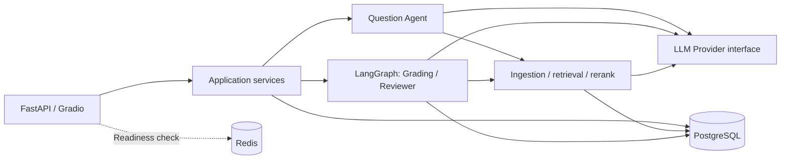

# EduAgent

[English](README.md) | [简体中文](README.zh-CN.md)

RAG-assisted educational assessment with structured AI outputs and human review.

EduAgent connects course materials, question preparation, student submissions, grading, and learning feedback. Teachers review AI-generated question candidates and low-confidence grades; students receive results and diagnosis based on confirmed scores.

## Project status

The package version is **0.1.0**. M0–M4 and M5 tasks T080–T087 and T090 are complete; T088 updates these docs, while T089 end-to-end acceptance remains pending. This is a local development/demo project, not a claim that every UI or deployment scenario is release-ready.

The current Gradio interface is primarily in Chinese. See the [task list](.specify/tasks.md) for milestone details and separately tracked follow-up work.

## Core capabilities

- **Course knowledge ingestion:** PDF, TXT, and Markdown parsing, cleaning, chunking, and Embedding, with document processing states and traceable sources.
- **Four retrieval modes:** Vector Only, Keyword Only, Hybrid weighted score fusion, and Hybrid + Rerank. Results retain course, document, and chunk identifiers.
- **AI-assisted question preparation:** structured candidates, validation, and Teacher approval before questions can be used in an available exam.
- **Grading:** deterministic objective grading without LLM calls; subjective grading with course context, JSON/Pydantic validation, and a configurable confidence threshold.
- **Human review and recovery:** LangGraph routes individual answers, pauses for review, and resumes from persisted checkpoints after a Teacher decision.
- **Results and diagnosis:** pending review is distinct from a final score; diagnosis uses accepted or manually reviewed results, and outdated reports are marked stale.
- **Role boundaries:** Teacher, Student, and Admin permissions are enforced on the backend. Admin does not replace Teacher approval or grading review.

## Architecture



PostgreSQL holds business records, pgvector embeddings, full-text search data, and Workflow checkpoints. Redis is included in the runtime infrastructure; it is not the grading checkpoint store. The Compose setup has three services: `postgres`, `redis`, and `backend`, without a separate worker, Milvus, or Elasticsearch service.

| Layer | Implementation |
| --- | --- |
| API and demo UI | FastAPI, Gradio |
| Validation | Pydantic schemas and domain DTOs |
| Workflow | LangGraph with persisted state and human review |
| Persistence | SQLAlchemy, Alembic, PostgreSQL 16 |
| Retrieval | pgvector and PostgreSQL `tsvector`/GIN |
| Model access | Provider abstraction with a DeepSeek adapter and an OpenAI-compatible client |
| Default local Embedding | `BAAI/bge-large-zh-v1.5`, 1024 dimensions |
| Rerank | LLM adapter or an optional local Cross Encoder |

Four Agent modules define distinct responsibilities: Supervisor routing, Question generation, Grading orchestration, and Reviewer decisions. Production request paths use Question, Grading, and Reviewer; Supervisor is not wired into the production grading graph. See the [architecture guide](docs/architecture.md) for the actual nodes, conditional edges, and Provider boundaries.

## Quickstart

The primary setup runs **PostgreSQL and Redis in Docker, with the Python backend on the host**. This includes the optional dependencies needed for the default local BGE model.

### 1. Prepare the checkout

Requirements: Git, Python **3.12+**, Docker with Compose v2, network access for dependencies/model weights, and a valid DeepSeek API key for real AI operations.

Run from PowerShell:

```powershell
git clone --branch deepcode https://github.com/MiracleYjx/EduAgent.git
cd EduAgent
python -m venv .venv
.\.venv\Scripts\Activate.ps1
python -m pip install -e ".[dev,rerank-local]"
Copy-Item .env.example .env
$env:HF_HOME = Join-Path (Get-Location) ".cache/huggingface"
```

For an existing checkout, skip cloning and keep your existing `.env`. On macOS/Linux, replace the activation, copy, and cache-setting commands with:

```bash
source .venv/bin/activate
cp .env.example .env
export HF_HOME="$PWD/.cache/huggingface"
```

The `rerank-local` extra supplies `sentence-transformers` for both BGE Embedding and the optional Cross Encoder. The first model use downloads its weights; allow time and disk space for this. Set `HF_HOME` in the shell that launches the backend to reuse the repository cache.

### 2. Configure the environment

Generate a JWT signing secret and paste the output into `.env`:

```powershell
python -c "import secrets; print(secrets.token_urlsafe(32))"
```

Use the following settings for the unmodified local Compose database/Redis defaults. Replace both secret placeholders, and keep the other optional settings from [.env.example](.env.example).

```dotenv
DATABASE_URL=postgresql+psycopg://eduagent@127.0.0.1:5432/eduagent
REDIS_URL=redis://127.0.0.1:6379/0
LLM_PROVIDER=deepseek
DEEPSEEK_API_KEY=<your-deepseek-api-key>
DEEPSEEK_BASE_URL=https://api.deepseek.com
DEEPSEEK_MODEL=deepseek-chat
EMBEDDING_PROVIDER=huggingface
EMBEDDING_MODEL=BAAI/bge-large-zh-v1.5
EMBEDDING_DIMENSION=1024
RERANK_PROVIDER=llm
RERANK_MODEL=deepseek-chat
CONFIDENCE_THRESHOLD=0.80
JWT_SECRET_KEY=<paste-generated-secret>
DEV_MODE=true
```

`JWT_SECRET_KEY` must contain at least 32 characters. `DEV_MODE=true` is an explicit local-demo choice; the repository default is `false`. Never commit `.env`.

The Compose database uses trust authentication and loopback-bound ports for local development. These are not production deployment settings. If database credentials or published ports were customized, update the host connection URLs accordingly.

### 3. Start dependencies, migrate, and run

```powershell
docker compose up -d --wait postgres redis
python -m alembic upgrade head
python -m uvicorn backend.main:app --host 127.0.0.1 --port 8000
```

Run migrations before logging in or creating data. If a Compose backend is already using port 8000, stop that backend with `docker compose stop backend` before launching the host process.

| Entry point | Address | Purpose |
| --- | --- | --- |
| Demo UI | `http://127.0.0.1:8000/gradio/` | Role-based workspaces |
| API documentation | `http://127.0.0.1:8000/docs` | Inspect and call endpoints |
| Liveness | `http://127.0.0.1:8000/health` | Process health |
| Readiness | `http://127.0.0.1:8000/ready` | Configuration, PostgreSQL, and Redis checks |

A successful readiness response does not validate model credentials, downloaded weights, or the entire AI workflow.

### 4. Log in for a local demo

With development mode enabled, use the Admin, Teacher, or Student quick-login button. The UI prepares `dev_admin`, `dev_teacher`, and `dev_student` accounts and issues normal JWTs; there is no shared default password.

For password-based API use, create users through the Admin workspace, call `POST /api/auth/login`, and supply the returned bearer token to protected endpoints. The [development-mode guide](docs/dev-mode.md) explains account lifecycle and cleanup. Disabling development mode does not delete those accounts or revoke existing tokens.

### Alternative: run the backend in Docker

The current [Dockerfile](Dockerfile) installs runtime dependencies (`pip install .`), **not local BGE/Cross Encoder dependencies**. Docker Demo configures a cloud `openai_compatible` Embedding provider using `DEMO_EMBEDDING_MODEL`, `DEMO_EMBEDDING_BASE_URL`, and `DEMO_EMBEDDING_API_KEY`; the model must actually return **1024-dimensional** vectors. No secrets are built into the image, and cloud failures do not trigger a local-model fallback.

After configuring the provider, use this alternative to the host backend:

```powershell
docker compose build backend
docker compose up -d --wait postgres redis
docker compose run --rm --no-deps backend python -m alembic upgrade head
docker compose up -d --wait backend
```

Compose supplies container-internal PostgreSQL and Redis URLs. Stop the host backend before starting the container on the same port. For a seeded demo, enable `DEV_MODE=true`, configure cloud Embedding in `.env`, then run `./scripts/run_demo.ps1`. It starts the three containers, migrates, and idempotently seeds a course, knowledge base, questions, and exam. A healthy container does not prove AI calls work; seeding may incur provider charges. See the [development guide](docs/development.md).

## Assessment workflow

Use the available Gradio views and API documentation to follow these checkpoints. A fresh database does not seed itself; run `scripts/run_demo.ps1` for demo content. The seed does not create a student submission.

1. **Teacher:** create a course and its knowledge base, upload a supported document, and confirm that processing reaches `Ready`.
2. **Teacher:** create questions manually or generate AI candidates from course material. Review candidates before adding approved questions to an exam.
3. **Student:** open an available exam and submit answers. Single-choice, true/false, and short-answer questions form a representative MVP example.
4. **Teacher:** start the LangGraph grading path with `POST /api/workflow/submissions/{submission_id}/runs`; inspect `GET /api/workflow/runs/{workflow_id}` for status.
5. **Teacher:** confirm or modify low-confidence grades through the review workspace/API. If the decision is saved but resumption fails, use `POST /api/workflow/runs/{workflow_id}/resume` to continue the original run.
6. **Student / Teacher:** view confirmed results and diagnosis. Pending review must not appear as a final score.

The separate `/api/grading` task API remains available. Its M3 background-task checkpoints are not interchangeable with LangGraph runtime checkpoints; use `/api/workflow` for the pause/resume walkthrough.

## Testing

Use a development/test database. PostgreSQL-backed tests require reachable PostgreSQL with pgvector and the relevant schema; tests report skips when prerequisites are unavailable.

Mypy and Ruff are used by the project checks but are not included in the current `dev` extra. Install them separately to run all three checks:

```powershell
python -m pip install mypy ruff
python -m pytest tests/ -q
python -m mypy backend/app/
python -m ruff check backend/ tests/
```

The M0 container smoke test also requires the isolated settings `COMPOSE_PROJECT_NAME=eduagent-test`, `POSTGRES_PORT=15432`, `REDIS_PORT=16379`, and `BACKEND_PORT=18000`; see its [prerequisites](tests/integration/test_m0_smoke.py). A skipped smoke test is not a deployment verification.

Historical test records are not evidence for the current checkout. This documentation-only task checks diffs and links; rerun project gates before development or release.

## Evaluation

### Grading pipeline self-test

After configuring the environment, this uses deterministic substitutes and does not need real model calls or the persisted retrieval corpus:

```powershell
python scripts/run_grading_benchmark.py --mode selftest
```

It exercises Zero-shot, RAG, and Hybrid + Rerank strategies. The committed [grading self-test report](benchmark/results/grading_selftest-t059.json) contains synthetic reference scores and no Teacher-labeled ground truth, so it does not establish grading accuracy, MAE, RMSE, or agreement with Teachers.

### Real providers and prepared-corpus runs

With local model weights and credentials available, the RAG smoke script exercises real ingestion and retrieval. It creates and cleans up its own course/account records; it does not bootstrap the shared benchmark corpus.

```powershell
python scripts/smoke_rag_providers.py
```

Retrieval Benchmark now initializes an isolated schema and records real runtime UUIDs in a manifest; it does not require pre-existing database IDs from the [old corpus list](benchmark/corpus/chunks.json). To check the reproducible pipeline with stubs:

```powershell
python scripts/setup_benchmark_corpus.py --self-test --output-dir .cache/benchmark/corpus-stub
python scripts/run_retrieval_benchmark.py --self-test --manifest .cache/benchmark/corpus-stub/manifest.json --queries 999 --run-id stub-01 --output-dir .cache/benchmark/results
```

For real providers and Teacher-label formats, see the [Benchmark reproduction guide](docs/benchmark.md). `--self-test` proves the pipeline, not model quality. Real calls may incur charges; failures and absent metrics are not fabricated as zero scores. The [evaluation guide](docs/evaluation.md) explains comparable conditions and dashboard read authorization.

The [retrieval comparison report](docs/retrieval-benchmark-v2.md) covers 20 queries and 21 chunks. Its small, partly model-assisted label set and Chinese tokenization limitations restrict what can be concluded. Compare runs only with their dataset, model, Prompt, and configuration metadata.

## Known limits and roadmap

- PostgreSQL `simple` full-text search does not provide Chinese word segmentation; the recorded Chinese benchmark has zero keyword recall. Hybrid/Rerank quality gains are not guaranteed for a new dataset.
- The current schema requires 1024-dimensional embeddings. Changing the Embedding model requires re-ingesting affected documents, even if dimensions stay the same.
- LLM Rerank and real grading depend on external provider availability and latency. LLM Rerank failure does not automatically select the Cross Encoder.
- Some UI integration and responsive-layout acceptance work remains separately tracked. Backend integration tests do not establish that every screen has been manually verified.
- Supervisor is not wired into the production grading graph. A unified JSON log pipeline is not yet fully wired; see [observability](docs/observability.md).

M5 includes an in-app JWT-authorized MCP-style tool boundary, audit/Trace, evaluation dashboard code, and Docker demo seeding. It does **not** provide external standard MCP transport or real email delivery. The evaluation dashboard entry remains hidden until an explicit production read-authorization contract exists. T089 end-to-end validation is pending; prefix-cache optimization is separate.

## Repository guide

```text
backend/
  main.py                 Application entry point
  app/
    ai/                   Ingestion, Embedding, retrieval, Providers, Agents, Workflow
    api/                  HTTP endpoints and API service assembly
    services/             Business services, grading, review, checkpoints
    models/               SQLAlchemy persistence models
    schemas/              Pydantic DTOs
    ui/                   Gradio views and loaders
    core/                 Configuration, database, Redis, authentication
migrations/               Alembic migrations
scripts/                  Smoke checks and benchmark runners
tests/                    Unit, contract, and integration tests
benchmark/                Evaluation corpora, manifests, and recorded results
docs/                     Development guides and technical reports
```

## Further reading

The detailed guides below are currently in Chinese; the benchmark result index is also available in the repository.

| Document | Contents |
| --- | --- |
| [Local development](docs/development.md) | Provider dependencies, model cache, and local operation |
| [Architecture and boundaries](docs/architecture.md) | Containers, Agents, Workflow, and MVP scope |
| [Evaluation guide](docs/evaluation.md) | Metrics, evidence, and dashboard authorization |
| [Benchmark reproduction](docs/benchmark.md) | Isolated corpus, manifests, and Teacher labels |
| [Observability](docs/observability.md) | Audit, Trace, and optional monitoring |
| [Development-mode login](docs/dev-mode.md) | Demo roles and account lifecycle |
| [Development-mode removal checklist](docs/dev-mode-removal-checklist.md) | Cleanup before a production deployment |
| [Retrieval evaluation](docs/retrieval-benchmark-v2.md) | Recorded results, limitations, and interpretation |
| [Benchmark result index](benchmark/results/README.md) | Result files and metadata conventions |
| [Milestones](.specify/tasks.md) | Implementation tasks and follow-up work |
