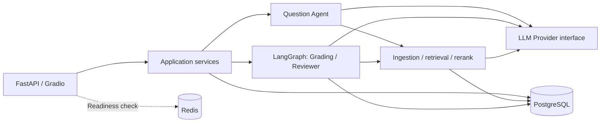

# EduAgent

[English](README.md) | [简体中文](README.zh-CN.md)

RAG-assisted educational assessment with structured AI outputs and human review.

EduAgent connects course materials, question preparation, student submissions, grading, and learning feedback. Teachers review AI-generated question candidates and low-confidence grades; students receive results and diagnosis based on confirmed scores.

The Gradio interface provides role-based workspaces, primarily in Chinese.

## Project status — v2.0

The **`v2.0` Git tag** marks the accepted learning-project delivery on 2026-10-07. The 58 tasks T134–T191 are complete under the agreed acceptance criteria. The package version in `pyproject.toml` remains `0.1.0`; the Git release tag is tracked separately.

This version adds paper import and correction, CPU OCR, chapter-scoped retrieval, question adaptation and semantic validation, conditional exam assembly, exam-specific scoring, richer results, and Windows EXE packaging. The [delivery checklist](docs/v2.0-delivery-checklist.md) indexes the final artifacts, acceptance evidence, database state, and remaining limitations. The original business database was still at `0012_audit_logs` during that review; a source release does not upgrade an existing database.

## Core capabilities

- **Course knowledge ingestion:** PDF, TXT, and Markdown parsing, cleaning, chunking, and Embedding, with document processing states and traceable sources.
- **Four retrieval modes:** Vector Only, Keyword Only, Hybrid weighted score fusion, and Hybrid + Rerank. Results retain course, document, and chunk identifiers.
- **AI-assisted question preparation:** structured candidates, validation, and Teacher approval before questions can be used in an available exam.
- **Persistent question evidence:** source snapshots, actual generation metadata, and revision comments survive across requests. Deleted source chunks retain their historical snapshots with a clear UI label.
- **Grading:** deterministic objective grading without LLM calls; subjective grading with course context, JSON/Pydantic validation, and a configurable confidence threshold.
- **Human review and recovery:** LangGraph routes individual answers, pauses for review, and resumes from persisted checkpoints after a Teacher decision.
- **Results and diagnosis:** pending review is distinct from a final score; diagnosis uses accepted or manually reviewed results, and outdated reports are marked stale.
- **Role boundaries:** Teacher, Student, and Admin permissions are enforced on the backend. Admin does not replace Teacher approval or grading review.
- **Engineering support:** JWT-authorized in-app tools, audit logs, Agent/Workflow traces, reproducible Benchmark runners, and idempotent demo seeds. Dashboard access requires explicit read authorization.

## What is new in v2.0

- **Paper import and correction:** import text, scanned, or mixed PDFs and images; compare original pages with structured questions; correct, reject, and confirm questions idempotently. Options retain JSON key order, and unknown answers, boundaries, or image assets remain explicitly unknown.
- **Local CPU OCR:** RapidOCR 3.9.2 + ONNX Runtime 1.30.0, with external PP-OCRv5 mobile weights. OCR is explicitly enabled; unavailable OCR or extraction failures retain their actual error state. Source papers are excluded from teaching-material retrieval.
- **Chapter and knowledge-point scope:** confirm chapter/section locations and chunk tags, then pass an explicit retrieval scope to generation and grading. Knowledge-point tags remain in JSONB metadata.
- **Question adaptation and review:** adapt imported questions, check images with a separately configured vision model, persist semantic-validation reports, and require current validation before approval. Input changes invalidate earlier evidence. Student-visible images default to off; source papers and answer-bearing full pages remain private.
- **Conditional assembly and exam scoring:** select questions by teaching requirements, show shortages, reorder or replace questions, and set exam-specific scores and Rubrics. Assembly constraints record intent; `ExamQuestion` supplies the actual order and scores. Publishing freezes the grading basis.
- **Teaching and learning feedback:** teacher distributions, per-question results, knowledge-point losses, and attention lists; student answer feedback and recommendations backed by accessible course sources. Pending, failed, and unavailable results remain distinct.
- **Durable files and Windows delivery:** registered storage, explicit historical-file migration, coordinated database/file backup and isolated restore, and a PyInstaller onedir package with external configuration and data.

## Architecture



PostgreSQL holds business records, pgvector embeddings, full-text search data, and Workflow checkpoints. Redis is included in the runtime infrastructure; it is not the grading checkpoint store. The Compose setup has three services: `postgres`, `redis`, and `backend`, without a separate worker, Milvus, or Elasticsearch service.

| Layer | Implementation |
| --- | --- |
| API and demo UI | FastAPI, Gradio |
| Validation | Pydantic schemas and domain DTOs |
| Workflow | LangGraph with persisted state and human review |
| Persistence | SQLAlchemy, Alembic, PostgreSQL 16 |
| Retrieval | pgvector and PostgreSQL `tsvector`/GIN |
| Model access | Provider abstraction with a DeepSeek adapter and an OpenAI-compatible client |
| Default local Embedding | `BAAI/bge-large-zh-v1.5`, 1024 dimensions |
| Rerank | LLM adapter or an optional local Cross Encoder |

## How it works

### Course material to retrieval context

The [ingestion pipeline](backend/app/ai/ingestion/service.py) parses documents, cleans text, splits it into chunks, and requests vectors from an Embedding provider. The knowledge-base service persists the chunks with their source metadata and vectors in PostgreSQL. Retrieval stays within the requested course.

| Mode | Retrieval method |
| --- | --- |
| `vector_only` | Embed the query and retrieve semantically similar chunks through pgvector |
| `keyword_only` | Match terms using PostgreSQL full-text search |
| `hybrid` | Normalize vector and keyword scores separately, then combine them with configurable weights |
| `hybrid_rerank` | Rerank the hybrid candidate set with the selected Rerank provider |

The [hybrid retriever](backend/app/ai/retrieval/hybrid_search.py) preserves source identifiers and scores so downstream question generation and grading can reference the retrieved evidence. PostgreSQL's `simple` text-search configuration does not segment Chinese words; corpus language and query formulation affect keyword matching.

### Structured Agents and question generation

Agent inputs and outputs use typed schemas rather than free-form text between components. Each Agent has a distinct responsibility:

| Agent | Responsibility |
| --- | --- |
| Question | Generate structured candidates from course context for validation and Teacher approval |
| Grading | Coordinate objective and subjective grading and return structured results |
| Reviewer | Check structured result consistency and recommend acceptance, revision, or regrading without replacing Teacher decisions |
| Supervisor | Provide deterministic routing decisions from explicit task types and state snapshots; the grading execution path is controlled by the LangGraph graph |

The [Question Agent](backend/app/ai/agents/question_agent.py) calls the resolved LLM provider and passes its output to validation. The [generation service](backend/app/api/question_generation.py) writes each batch's questions, source snapshots, and generation metadata in one transaction. Provider and model identity come from the actual provider instance, not guessed configuration values. Teacher approval is a separate operation.

Source snapshots store the text used for generation. If the original chunk is deleted, the live reference becomes null while the snapshot remains available as historical evidence. Revision comments are stored alongside the question's review history.

### Grading as a resumable graph

The [grading workflow](backend/app/ai/workflows/grading_workflow.py) processes answers through explicit nodes and conditional edges:

1. `load_submission` and `classify_question` load the submission and choose a grading branch.
2. `objective_rule_grade` uses deterministic scoring rules; `subjective_retrieve_grade` combines retrieved course material with an LLM grading request.
3. `structured_validation` checks the result schema, then `confidence_check` routes it to acceptance or human review.
4. `pending_review` pauses through LangGraph's native interrupt mechanism. A Teacher can confirm, modify, or request regrading; the saved checkpoint lets the same workflow resume across requests.
5. `next_answer` advances through the submission. `unified_result` aggregates scores, and `generate_diagnosis` produces learning feedback only when the finalization conditions are satisfied.

The [checkpoint service](backend/app/services/workflow_checkpoint.py) stores graph state in PostgreSQL. Business result persistence and review decisions use database transactions; a pending-review score is not presented as a final result. The review round identifier distinguishes a retry from a new review decision.

The start request runs the graph until it pauses or finishes, so its response time includes model calls. Query requests read the persisted workflow state.

### Provider, authorization, and observability boundaries

LLM, Embedding, and Rerank have separate interfaces. The [LLM provider interface](backend/app/ai/llm/base.py) exposes structured generation and provider metadata; callers can inject a provider without changing grading rules or graph structure. Rerank failures are returned explicitly rather than silently switching algorithms. Embeddings use a 1024-dimensional schema, and changing models requires re-ingesting the affected documents.

[JWT authentication and permissions](backend/app/core/security.py) establish the caller identity, while domain services enforce course ownership and access to results. Teacher, Student, and Admin are distinct roles; administrative access does not imply permission to perform Teacher-only AI operations.

The `mcp/` package exposes an in-app, JWT-authorized tool boundary, not an external MCP transport. Tools pass the trusted actor to existing services. The replaceable email adapter defaults to `not_configured`, never claiming that an email was sent.

AuditLog records sanitized business actions. AgentRun and WorkflowRun correlate model calls and graph execution with request/workflow identifiers. Trace data excludes credentials, full prompts, and student answer text. Explicit maintenance methods apply 180-day audit retention and 30-day AgentRun trace retention without deleting WorkflowRun recovery state.

## Quickstart

The primary setup runs **PostgreSQL and Redis in Docker, with the Python backend on the host**. This includes the optional dependencies needed for the default local BGE model.

### 1. Prepare the checkout

Requirements: Git, Python **3.12+**, Docker with Compose v2, network access for dependencies/model weights, and a valid DeepSeek API key for real AI operations.

Run from PowerShell:

```powershell
git clone --branch deepcode https://github.com/MiracleYjx/EduAgent.git
cd EduAgent
python -m venv .venv
.\.venv\Scripts\Activate.ps1
python -m pip install -e ".[dev,rerank-local]"
Copy-Item .env.example .env
$env:HF_HOME = Join-Path (Get-Location) ".cache/huggingface"
```

For an existing checkout, skip cloning and keep your existing `.env`. On macOS/Linux, replace the activation, copy, and cache-setting commands with:

```bash
source .venv/bin/activate
cp .env.example .env
export HF_HOME="$PWD/.cache/huggingface"
```

The `rerank-local` extra supplies `sentence-transformers` for both BGE Embedding and the optional Cross Encoder. The first model use downloads its weights; allow time and disk space for this. Set `HF_HOME` in the shell that launches the backend to reuse the repository cache.

Scanned-paper import additionally needs the OCR extra (`python -m pip install -e ".[ocr]"`), `OCR_ENABLED=true`, and the three preinstalled PP-OCRv5 mobile weights in `OCR_MODEL_DIR`. See the [OCR selection and setup](docs/evaluation.md) and [paper-import guide](docs/paper-import.md). The Windows build below includes the OCR runtime; weights remain external.

### 2. Configure the environment

Generate a JWT signing secret and paste the output into `.env`:

```powershell
python -c "import secrets; print(secrets.token_urlsafe(32))"
```

Use the following settings for the unmodified local Compose database/Redis defaults. Replace both secret placeholders, and keep the other optional settings from [.env.example](.env.example).

```dotenv
DATABASE_URL=postgresql+psycopg://eduagent@127.0.0.1:5432/eduagent
REDIS_URL=redis://127.0.0.1:6379/0
LLM_PROVIDER=deepseek
DEEPSEEK_API_KEY=<your-deepseek-api-key>
DEEPSEEK_BASE_URL=https://api.deepseek.com
DEEPSEEK_MODEL=deepseek-chat
EMBEDDING_PROVIDER=huggingface
EMBEDDING_MODEL=BAAI/bge-large-zh-v1.5
EMBEDDING_DIMENSION=1024
RERANK_PROVIDER=llm
RERANK_MODEL=deepseek-chat
CONFIDENCE_THRESHOLD=0.80
JWT_SECRET_KEY=<paste-generated-secret>
DEV_MODE=true
```

`JWT_SECRET_KEY` must contain at least 32 characters. `DEV_MODE=true` is an explicit local-demo choice; the repository default is `false`. Never commit `.env`.

The Compose database uses trust authentication and loopback-bound ports for local development. These are not production deployment settings. If database credentials or published ports were customized, update the host connection URLs accordingly.

### 3. Start dependencies, migrate, and run

```powershell
docker compose up -d --wait postgres redis
python -m alembic upgrade head
python -m uvicorn backend.main:app --host 127.0.0.1 --port 8000
```

Run migrations before logging in or creating data. If a Compose backend is already using port 8000, stop that backend with `docker compose stop backend` before launching the host process.

For optional demo content, run the following in the same virtual environment **after migration and before starting the backend**:

```powershell
python scripts/demo_seed.py
```

The seed requires `DEV_MODE=true` and a usable Embedding provider. In this development setup it uses local BGE, which may download weights on first use. Repeated execution reuses the demo accounts, course, knowledge base, questions, and exam; it does not create a student submission.

| Entry point | Address | Purpose |
| --- | --- | --- |
| Demo UI | `http://127.0.0.1:8000/gradio/` | Role-based workspaces |
| API documentation | `http://127.0.0.1:8000/docs` | Inspect and call endpoints |
| Liveness | `http://127.0.0.1:8000/health` | Process health |
| Readiness | `http://127.0.0.1:8000/ready` | Configuration, PostgreSQL, and Redis checks |

A successful readiness response does not validate model credentials, downloaded weights, or the entire AI workflow.

### 4. Log in for a local demo

With development mode enabled, use the Admin, Teacher, or Student quick-login button. The UI prepares `dev_admin`, `dev_teacher`, and `dev_student` accounts and issues normal JWTs; there is no shared default password.

For password-based API use, create users through the Admin workspace, call `POST /api/auth/login`, and supply the returned bearer token to protected endpoints. Disabling development mode does not delete demo accounts or revoke existing tokens; manage their access separately before deployment.

### Alternative: run the backend in Docker

The current [Dockerfile](Dockerfile) installs runtime dependencies (`pip install .`), **not local BGE/Cross Encoder dependencies**. Docker Demo configures a cloud `openai_compatible` Embedding provider using `DEMO_EMBEDDING_MODEL`, `DEMO_EMBEDDING_BASE_URL`, and `DEMO_EMBEDDING_API_KEY`; the model must actually return **1024-dimensional** vectors. No secrets are built into the image, and cloud failures do not trigger a local-model fallback.

After configuring the provider, use this alternative to the host backend:

```powershell
docker compose build backend
docker compose up -d --wait postgres redis
docker compose run --rm --no-deps backend python -m alembic upgrade head
docker compose up -d --wait backend
```

Compose supplies container-internal PostgreSQL and Redis URLs. Stop the host backend before starting the container on the same port. For a seeded demo, enable `DEV_MODE=true`, configure cloud Embedding in `.env`, then run `./scripts/run_demo.ps1`. It starts the three containers, migrates, and idempotently seeds a course, knowledge base, questions, and exam. A healthy container does not prove AI calls work; seeding may incur provider charges.

Use real provider settings for document ingestion and AI operations; placeholder credentials cannot supply embeddings.

## Build and run a Windows EXE

When the EXE is launched without a default configuration, a **local configuration window** opens first. Tabs cover connections/storage, text/vision models, Embedding, retrieval/grading, OCR, and authentication. Secrets are masked by default; buttons explicitly generate a JWT secret or select model directories. Saving validates file settings without testing connections. First-time saving continues normal startup checks; cancellation neither writes a file nor starts the service.

To edit an existing configuration, double-click `Configure-EduAgent.cmd` in the package or use the commands below. Unknown settings and comments are preserved. Save and close, then restart the application; changes do not hot-reload a running service.

```powershell
.\EduAgent.exe --configure
# Source-mode editing of an explicit .env:
python scripts/launch_windows.py --configure --config .env
```

The EXE defaults to `%LOCALAPPDATA%/EduAgent/config.env`; the window shows the exact target path. Unattended `--no-browser` startup and explicitly missing configuration paths retain their normal errors instead of opening a window.


On Windows with **Python 3.12+**, run the repository's [build script](scripts/build_exe.ps1) from the project root. This variant includes local BGE/Cross Encoder runtime libraries:

```powershell
.\scripts\build_exe.ps1 -WithLocalModels
```

The script creates its own build environment, installs `packaging/requirements-windows.txt`, and uses `packaging/EduAgent.spec`. Output is **`.cache/exe-build/dist/EduAgent/`**, containing `EduAgent.exe`, `_internal/`, a configuration template, and `build-receipt.json`. Copy the **entire directory** to the target machine. The tag on GitHub provides source; this command builds the binary locally.

For a cloud-Embedding-only package, omit `-WithLocalModels`; configure a real 1024-dimensional Embedding service. Local-model runtime libraries do not include model weights. Supply complete external BGE/Cross Encoder and, if enabled, OCR model directories; the Windows launcher does not download them.

Prepare PostgreSQL + pgvector and Redis separately. Create the external configuration without overwriting an existing one:

```powershell
$taskConfigDir = Join-Path $env:LOCALAPPDATA 'EduAgent'
New-Item -ItemType Directory -Path $taskConfigDir -Force | Out-Null
$taskConfigFile = Join-Path $taskConfigDir 'config.env'
if (-not (Test-Path -LiteralPath $taskConfigFile)) {
    Copy-Item .\config\windows.env.example $taskConfigFile
}
notepad $taskConfigFile
```

Fill the database/Redis URLs, JWT secret, model credentials, and model paths. For the local-Embedding build, set `EMBEDDING_PROVIDER=local` and `EMBEDDING_MODEL` to the complete external model directory. For cloud Embedding, retain `openai_compatible` and fill its own model, endpoint, and credentials. Set `DEV_MODE=true` only when intentionally using demo quick-login.

After backing up an existing database and confirming the target database, start the package:

```powershell
& .\.cache\exe-build\dist\EduAgent\EduAgent.exe --config $taskConfigFile --no-browser
```

The launcher checks dependencies and applies migrations before serving. Open `http://127.0.0.1:8000/gradio/` after readiness; omitting `--no-browser` opens it automatically. Ctrl+C stops the owned application process. The target machine does not need Python. Configuration, model weights, and business data stay outside the package; default data is `%LOCALAPPDATA%/EduAgent/storage`.

See the [deployment guide](docs/exe-deployment.md), [package notes](packaging/README.md), and [current delivery checklist](docs/v2.0-delivery-checklist.md). Earlier failure sections in deployment evidence are historical; the final T189 result is the current startup result. A new build needs its own verification; a build receipt records identity, not acceptance.

## Assessment workflow

Use the Gradio views and API documentation to follow this workflow. A fresh database does not seed itself: use `python scripts/demo_seed.py` in development mode, or `./scripts/run_demo.ps1` for Docker Demo with cloud Embedding configured. Neither seed path creates a student submission.

1. **Teacher:** create a course and its knowledge base, upload a supported document, and confirm that processing reaches `Ready`.
2. **Teacher:** create questions manually or generate AI candidates from course material. Review candidates before adding approved questions to an exam.
3. **Student:** open an available exam and submit answers. An exam can combine single-choice, true/false, and short-answer questions.
4. **Teacher:** start the LangGraph grading path with `POST /api/workflow/submissions/{submission_id}/runs`; inspect `GET /api/workflow/runs/{workflow_id}` for status.
5. **Teacher:** confirm or modify low-confidence grades through the review workspace/API. If the decision is saved but resumption fails, use `POST /api/workflow/runs/{workflow_id}/resume` to continue the original run.
6. **Student / Teacher:** view confirmed results and diagnosis. Pending review must not appear as a final score.

The separate `/api/grading` task API uses background-task checkpoints that are not interchangeable with LangGraph runtime checkpoints; use `/api/workflow` for pause and resume.

## Testing

Use a development/test database. PostgreSQL-backed tests require reachable PostgreSQL with pgvector and the relevant schema; tests report skips when prerequisites are unavailable.

Mypy and Ruff are used by the project checks but are not included in the current `dev` extra. Install them separately to run all three checks:

```powershell
python -m pip install mypy ruff
python -m pytest tests/ -q
python -m mypy backend/app/
python -m ruff check backend/ tests/
python -m alembic current
python -m alembic check
```

The container smoke test also requires the isolated settings `COMPOSE_PROJECT_NAME=eduagent-test`, `POSTGRES_PORT=15432`, `REDIS_PORT=16379`, and `BACKEND_PORT=18000`; see its [prerequisites](tests/integration/test_m0_smoke.py).

## Evaluation

### v2.0 recorded acceptance

T146/T168 use **AI-assisted labels + developer review**, synthetic papers, and no independent teacher labels. T168 formally adopts the v8 run: five papers, three rounds, 16 distinct reference questions and 48 evaluated instances. Unknown question types are excluded from that field's denominator (45).

| Field group | Recorded v8 result | Target |
| --- | --- | --- |
| Identity, number, order, source pages, options, answer, score | Each 48/48 (100%) | 100% |
| Question type | 45/45 (100%) | 100% of known labels |
| Content | 40/48 (83.33%) | ≥80% |
| Analysis | 41/48 (85.42%) | ≥80% |
| Scoring Rubric | 42/48 (87.50%) | ≥80% |
| Knowledge points | 43/48 (89.58%) | ≥70% |

Image assets are outside these thresholds: automatic image extraction is not implemented, and unknown assets are not treated as verified empty lists. [v8 field evidence](benchmark/results/v2/t168-bounded-20261007/round2-fields/summary.json) supersedes the earlier v6 field results; historical runs remain available.

The final Windows package reached both `/ready` and `/gradio/` in **9.005–9.670 s** on three first starts and **8.307–8.865 s** on five subsequent starts. Startup resource windows and normal exits passed 8/8. These are prepared-host measurements, excluding browser rendering and long-running model workloads. See [startup evidence](benchmark/results/v2/t189-optimize-20261007/README.md), [evaluation](docs/evaluation.md), and the [validation report](docs/validation-report.md). This README update does not rerun those checks.

### Grading pipeline self-test

After configuring the environment, this uses deterministic substitutes and does not need real model calls or the persisted retrieval corpus:

```powershell
python scripts/run_grading_benchmark.py --mode selftest
```

It exercises Zero-shot, RAG, and Hybrid + Rerank strategies. Self-tests check pipeline behavior, not grading quality. MAE, RMSE, and agreement metrics require Teacher-labeled ground truth; without it, these metrics remain `null` rather than using synthetic reference scores as human labels.

### Reproducible retrieval benchmark

The retrieval Benchmark initializes an isolated schema and records runtime document/chunk UUIDs in a manifest, so no pre-existing database IDs are required. To check the reproducible pipeline with stubs:

```powershell
python scripts/setup_benchmark_corpus.py --self-test --output-dir .cache/benchmark/corpus-stub
python scripts/run_retrieval_benchmark.py --self-test --manifest .cache/benchmark/corpus-stub/manifest.json --queries 999 --run-id stub-01 --output-dir .cache/benchmark/results
```

Use each script's `--help` for available real-provider options. `--self-test` proves the pipeline, not model quality. Real calls may incur charges; failures and absent metrics are not fabricated as zero scores. Dashboard reads require explicit authorization.

The small synthetic retrieval dataset and Chinese tokenization limitations restrict what can be concluded. Compare runs only with their dataset, model, Prompt, and configuration metadata; synthetic grading reference scores are not Teacher ground truth.

## Known limits

- The quality baseline is small, synthetic, and AI-assisted. It verifies the accepted learning-project workflow; further quality improvement needs independent teacher annotations and broader data.
- Semantic condition false positives remain **16.67%** (target ≤10%); semantic Rubric coverage **77.78%** (target ≥90%); image-condition completeness **72.73%** (target ≥95%). These separate metrics remain recorded limitations despite the passing v8 import-field thresholds.
- Automatic image detection, cropping, and question association remain future work (`assets` 0/48 in automatic extraction). Current image understanding and teacher correction do not constitute an automatic image-extraction pipeline.
- The original database review found 11 unapplied v2.0 migrations, 0013–0023; the source chain ends at `0023_grading_exam_question`. Back up and verify before upgrading an existing environment. Restore verification does not automatically activate the restored environment.
- Windows acceptance used an already prepared local machine, not a clean target installation. Docker readiness and synthetic tests do not establish the Docker cloud-AI chain or real-school production readiness.
- PostgreSQL `simple` search does not segment Chinese; Embedding requires 1024 dimensions and re-ingestion when changing models. Model quality, external-service latency, and workflow response times are distinct from EXE startup time.

The [delivery checklist](docs/v2.0-delivery-checklist.md) retains the full limitations and measurement boundaries.

## Documentation

| Guide | Contents |
| --- | --- |
| [Delivery checklist](docs/v2.0-delivery-checklist.md) | Current v2.0 status, artifacts, database state, and limits |
| [Paper import](docs/paper-import.md) | OCR, correction, images, and confirmation |
| [File lifecycle](docs/file-lifecycle.md) | Durable file identities and access rules |
| [Storage operations](docs/v2.0-storage-operations.md) | Migration, coordinated backup, and isolated restore |
| [EXE deployment](docs/exe-deployment.md) / [package notes](packaging/README.md) | Build and launch configuration |
| [Evaluation](docs/evaluation.md) / [validation](docs/validation-report.md) | Protocols, current results, and historical evidence |
| [Test change record](docs/test-change-record-v2.md) | Test changes and their coverage |

## Repository guide

```text
backend/
  main.py                 Application entry point
  app/
    ai/                   Ingestion, Embedding, retrieval, Providers, Agents, Workflow
    api/                  HTTP endpoints and API service assembly
    mcp/                  In-app authorized tool boundary and adapters
    services/             Business services, grading, review, checkpoints
    models/               SQLAlchemy persistence models
    schemas/              Pydantic DTOs
    ui/                   Gradio views and loaders
    core/                 Configuration, database, Redis, authentication
migrations/               Alembic migrations
scripts/                  Launch/build, storage maintenance, demo seeds, benchmark runners
packaging/                PyInstaller spec, pinned Windows dependencies, build receipts
config/                   External Windows configuration template
docs/                     User guides, acceptance evidence, delivery checklist
tests/                    Unit, contract, and integration tests
benchmark/                Evaluation corpora, manifests, and recorded results
```
