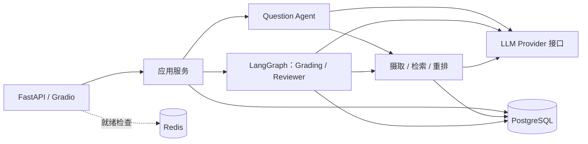

# EduAgent

[English](README.md) | [简体中文](README.zh-CN.md)

基于 RAG、结构化 AI 输出与人工复核的教学评测项目。

EduAgent 连接课程资料、题目准备、学生答卷、评分与学习反馈。教师审核 AI 生成的候选题，并复核低置信度评分；学生查看基于已确认成绩生成的结果与诊断。

## 项目状态

项目包版本为 **0.1.0**。M0–M4 与 M5 的 T080–T087、T090 已完成；T088 为本文档更新，T089 端到端验收仍待执行。本项目面向本地开发与演示；任务完成不代表所有 UI 路径或部署场景均通过发布验收。

当前 Gradio 界面主要使用中文。里程碑详情与单独追踪的后续工作见[任务清单](.specify/tasks.md)。

## 核心能力

- **课程知识摄取**：解析 PDF、TXT、Markdown，完成清洗、分块和 Embedding，保留处理状态及可追溯来源。
- **四种检索模式**：Vector Only、Keyword Only、Hybrid 加权分数融合、Hybrid + Rerank；结果保留课程、资料和片段标识。
- **AI 辅助题目准备**：生成结构化候选题，经过校验及教师审核后，才能用于可参加的考试。
- **阅卷**：客观题由确定性规则评分，不调用 LLM；主观题结合课程上下文，经过 JSON/Pydantic 校验及可配置的置信度检查。
- **人工复核与恢复**：LangGraph 按题路由，待复核时暂停，教师作出决定后从持久化检查点恢复。
- **成绩与诊断**：区分待复核和最终成绩；诊断仅使用已接受或人工复核的评分，过期报告标记为 Stale。
- **角色边界**：后端执行 Teacher、Student、Admin 权限检查，管理员不能代替教师审核题目或复核评分。

## 架构



PostgreSQL 保存业务数据、pgvector 向量、全文检索数据和 Workflow 检查点。Redis 属于运行基础设施，不承担阅卷检查点存储。Compose 包含 `postgres`、`redis`、`backend` 三个服务，不要求独立 Worker、Milvus 或 Elasticsearch 服务。

| 层次 | 实现 |
| --- | --- |
| API 与演示界面 | FastAPI、Gradio |
| 校验 | Pydantic Schema 与领域 DTO |
| Workflow | LangGraph、持久化状态与人工复核 |
| 持久化 | SQLAlchemy、Alembic、PostgreSQL 16 |
| 检索 | pgvector、PostgreSQL `tsvector`/GIN |
| 模型接入 | Provider 抽象、DeepSeek 适配器与 OpenAI-compatible 客户端 |
| 默认本地 Embedding | `BAAI/bge-large-zh-v1.5`，1024 维 |
| Rerank | LLM 适配器或可选的本地 Cross Encoder |

四类 Agent 模块分别承担 Supervisor 路由、Question 出题、Grading 阅卷编排、Reviewer 复核决策。当前请求路径使用 Question、Grading 和 Reviewer；Supervisor 尚未接入生产阅卷图。节点与条件边、Provider 边界详见[架构文档](docs/architecture.md)。

## 快速开始

主路径采用 **Docker 运行 PostgreSQL、Redis，本机运行 Python 后端**，并安装默认本地 BGE 所需的可选依赖。

### 1. 准备代码与环境

前置条件：Git、Python **3.12+**、支持 Compose v2 的 Docker、下载依赖和模型权重所需的网络，以及执行真实 AI 操作所需的有效 DeepSeek API Key。

在 PowerShell 中执行：

```powershell
git clone --branch deepcode https://github.com/MiracleYjx/EduAgent.git
cd EduAgent
python -m venv .venv
.\.venv\Scripts\Activate.ps1
python -m pip install -e ".[dev,rerank-local]"
Copy-Item .env.example .env
$env:HF_HOME = Join-Path (Get-Location) ".cache/huggingface"
```

已有工作区可跳过克隆，并保留原有 `.env`。macOS/Linux 用户将激活环境、复制配置和设置缓存的命令替换为：

```bash
source .venv/bin/activate
cp .env.example .env
export HF_HOME="$PWD/.cache/huggingface"
```

`rerank-local` 提供 `sentence-transformers`，供 BGE Embedding 和可选 Cross Encoder 共用。首次使用模型时会下载权重，请预留时间和磁盘空间。在启动后端的同一终端中设置 `HF_HOME`，即可复用项目内缓存。

### 2. 配置环境变量

生成 JWT 签名密钥，将输出粘贴到 `.env`：

```powershell
python -c "import secrets; print(secrets.token_urlsafe(32))"
```

以下配置对应未修改的本地 Compose 数据库与 Redis 默认值。替换两处密钥占位符，其他可选设置沿用 [.env.example](.env.example)。

```dotenv
DATABASE_URL=postgresql+psycopg://eduagent@127.0.0.1:5432/eduagent
REDIS_URL=redis://127.0.0.1:6379/0
LLM_PROVIDER=deepseek
DEEPSEEK_API_KEY=<your-deepseek-api-key>
DEEPSEEK_BASE_URL=https://api.deepseek.com
DEEPSEEK_MODEL=deepseek-chat
EMBEDDING_PROVIDER=huggingface
EMBEDDING_MODEL=BAAI/bge-large-zh-v1.5
EMBEDDING_DIMENSION=1024
RERANK_PROVIDER=llm
RERANK_MODEL=deepseek-chat
CONFIDENCE_THRESHOLD=0.80
JWT_SECRET_KEY=<paste-generated-secret>
DEV_MODE=true
```

`JWT_SECRET_KEY` 至少需要 32 个字符。这里显式开启 `DEV_MODE=true` 以便本地演示，仓库默认值为 `false`。不要提交 `.env`。

Compose 数据库采用 trust 认证，并将端口绑定到本地回环地址，仅面向本地开发，不是生产部署配置。如果修改过数据库凭据或映射端口，应相应调整本机连接地址。

### 3. 启动依赖、迁移数据库并运行

```powershell
docker compose up -d --wait postgres redis
python -m alembic upgrade head
python -m uvicorn backend.main:app --host 127.0.0.1 --port 8000
```

登录或创建业务数据前先执行迁移。如果 Compose 后端已经占用 8000 端口，先执行 `docker compose stop backend`，再启动本机后端。

| 入口 | 地址 | 用途 |
| --- | --- | --- |
| 演示界面 | `http://127.0.0.1:8000/gradio/` | 按角色使用工作台 |
| API 文档 | `http://127.0.0.1:8000/docs` | 查看并调用接口 |
| 存活检查 | `http://127.0.0.1:8000/health` | 检查进程是否存活 |
| 就绪检查 | `http://127.0.0.1:8000/ready` | 检查配置、PostgreSQL 和 Redis |

就绪检查成功不代表模型凭据、模型权重或完整 AI 工作流已经验证通过。

### 4. 本地演示登录

开启开发模式后，点击管理员、教师或学生快速登录按钮。界面会准备 `dev_admin`、`dev_teacher`、`dev_student` 账号并签发标准 JWT，没有统一的默认密码。

如需通过密码使用 API，可在管理员工作台创建用户，调用 `POST /api/auth/login`，再携带返回的 Bearer Token 访问受保护接口。[开发模式说明](docs/dev-mode.md)介绍了账号生命周期与清理方式；关闭开发模式不会删除这些账号，也不会撤销已有令牌。

### 备选：在 Docker 中运行后端

当前 [Dockerfile](Dockerfile) 安装项目运行依赖（`pip install .`），**不包含本地 BGE/Cross Encoder 依赖**。Docker Demo 通过 `DEMO_EMBEDDING_MODEL`、`DEMO_EMBEDDING_BASE_URL`、`DEMO_EMBEDDING_API_KEY` 配置云端 `openai_compatible` Embedding；模型须实际返回 **1024 维**向量。镜像不内置密钥，也不会在云端不可用时自动切换本地模型。

完成 Provider 配置后，可用下面的方式代替本机后端：

```powershell
docker compose build backend
docker compose up -d --wait postgres redis
docker compose run --rm --no-deps backend python -m alembic upgrade head
docker compose up -d --wait backend
```

Compose 会提供容器内部的 PostgreSQL 与 Redis 地址。启动容器前先停止占用同一端口的本机后端。更方便的演示入口是先在 `.env` 启用 `DEV_MODE=true` 并填写云端配置，再运行 `./scripts/run_demo.ps1`；它启动三容器、迁移并幂等灌入课程、知识库、题目和考试。健康检查不等于 AI 链路验收，脚本可能产生云端模型费用。详情见[开发指南](docs/development.md)。

## 教学评测流程

结合已接线的 Gradio 页面和 API 文档，按以下检查点操作。空数据库不会自动预置数据；需要演示种子时执行 `scripts/run_demo.ps1`，该脚本不创建学生答卷。

1. **教师**：创建课程及其知识库，上传受支持的资料，确认处理状态达到 `Ready`。
2. **教师**：手工创建题目或根据课程资料生成 AI 候选题；审核通过后再加入考试。
3. **学生**：打开可参加的考试并提交答案。单选、判断和简答可组成一份代表性的 MVP 示例。
4. **教师**：调用 `POST /api/workflow/submissions/{submission_id}/runs` 启动 LangGraph 阅卷，通过 `GET /api/workflow/runs/{workflow_id}` 查询状态。
5. **教师**：通过复核工作台或 API 确认、修改低置信度评分。如果结论已保存但恢复失败，调用 `POST /api/workflow/runs/{workflow_id}/resume` 继续原运行。
6. **学生／教师**：查看已确认成绩和诊断；待复核状态不得被展示为最终成绩。

独立的 `/api/grading` 任务 API 仍然保留。其 M3 后台任务检查点不能替代 LangGraph 运行检查点；演示暂停与恢复时应使用 `/api/workflow` 路径。

## 测试

使用开发或测试数据库。PostgreSQL 测试需要可连接的数据库、pgvector 及相应表结构；前置条件不可用时，测试会报告跳过。

项目门禁使用 Mypy 和 Ruff，但当前 `dev` 依赖组未包含这两个工具，需要单独安装后执行三项检查：

```powershell
python -m pip install mypy ruff
python -m pytest tests/ -q
python -m mypy backend/app/
python -m ruff check backend/ tests/
```

M0 容器冒烟还要求隔离设置：`COMPOSE_PROJECT_NAME=eduagent-test`、`POSTGRES_PORT=15432`、`REDIS_PORT=16379`、`BACKEND_PORT=18000`，具体见[测试前置条件](tests/integration/test_m0_smoke.py)。跳过冒烟不能视为部署验证通过。

历史测试记录不代表当前工作区的验证结论；本次纯文档任务仅检查差异与链接。开发与发布前应重新执行上述门禁。

## 评测

### 阅卷管道自检

完成环境配置后，可运行确定性替身自检，无需真实模型调用或已持久化的检索语料：

```powershell
python scripts/run_grading_benchmark.py --mode selftest
```

自检覆盖 Zero-shot、RAG、Hybrid + Rerank 三种策略。已提交的[阅卷自检报告](benchmark/results/grading_selftest-t059.json)使用合成参考分数，没有教师人工评分基准，不能据此证明阅卷准确率、MAE、RMSE 或与教师评分的一致率。

### 真实 Provider 与已准备语料的评测

本地模型权重和凭据就绪后，RAG 冒烟脚本可验证真实摄取与检索。它会创建并清理自己的课程和账号，不会初始化共用的评测语料。

```powershell
python scripts/smoke_rag_providers.py
```

检索 Benchmark 已提供隔离 schema 初始化脚本，运行时生成真实 UUID manifest；无需预置[旧清单](benchmark/corpus/chunks.json)里的数据库 UUID。可先用替身验证可复现管道：

```powershell
python scripts/setup_benchmark_corpus.py --self-test --output-dir .cache/benchmark/corpus-stub
python scripts/run_retrieval_benchmark.py --self-test --manifest .cache/benchmark/corpus-stub/manifest.json --queries 999 --run-id stub-01 --output-dir .cache/benchmark/results
```

真实 Provider 运行及教师标签格式见 [Benchmark 复现指南](docs/benchmark.md)；`--self-test` 仅验证管道，不是质量结论。真实模型调用可能计费；失败与缺失指标不会伪装成零分。[评测解读](docs/evaluation.md)说明同条件比较和看板读取授权。

[检索对比报告](docs/retrieval-benchmark-v2.md)覆盖 20 个查询、21 个片段；小样本、部分由模型参与的标注及中文分词限制影响结论的适用范围。比较实验时，应同时核对数据集、模型、Prompt 和配置元数据。

## 已知限制与路线图

- PostgreSQL `simple` 全文检索不提供中文分词，已记录的中文评测中关键词召回为零；不能保证 Hybrid/Rerank 在新数据集上一定改善效果。
- 当前表结构要求 1024 维向量。切换 Embedding 模型后，即使维度相同，也需要重新摄取受影响资料。
- LLM Rerank 和真实阅卷依赖外部 Provider 的可用性与延迟；LLM Rerank 失败不会自动切换 Cross Encoder。
- 部分 UI 接线与响应式布局验收仍被单独追踪；后端集成测试通过不代表所有页面均已完成人工验证。
- Supervisor 尚未接入生产阅卷图；统一 JSON 日志管道尚未完整接线，详见[可观测性文档](docs/observability.md)。

M5 已具备站内 JWT 认证的 MCP 风格工具边界、审计与 Trace、评测看板代码以及 Docker 演示种子。但没有标准 MCP 外部传输或真实邮件发送；评测看板因缺少生产读取授权合同，入口仍隐藏。T089 端到端验证尚未完成。前缀缓存优化另有计划。

## 目录说明

```text
backend/
  main.py                 应用入口
  app/
    ai/                   摄取、Embedding、检索、Provider、Agent、Workflow
    api/                  HTTP 端点与 API 服务装配
    services/             业务服务、评分、复核、检查点
    models/               SQLAlchemy 持久化模型
    schemas/              Pydantic DTO
    ui/                   Gradio 页面与加载器
    core/                 配置、数据库、Redis、认证
migrations/               Alembic 迁移
scripts/                  冒烟检查与评测执行器
tests/                    单元、契约与集成测试
benchmark/                评测语料、清单及结果记录
docs/                     开发指南与技术报告
```

## 延伸阅读

以下详细指南目前主要使用中文，仓库也提供评测结果索引。

| 文档 | 内容 |
| --- | --- |
| [本地开发](docs/development.md) | Provider 依赖、模型缓存与本地运行 |
| [架构与边界](docs/architecture.md) | 三容器、Agent、Workflow 与 MVP 范围 |
| [评测解读](docs/evaluation.md) | 指标、数据真实性与看板授权 |
| [Benchmark 复现](docs/benchmark.md) | 隔离语料、manifest 与教师标签 |
| [可观测性](docs/observability.md) | 审计、Trace 与可选监控扩展 |
| [开发模式登录](docs/dev-mode.md) | 演示角色与账号生命周期 |
| [开发模式清理清单](docs/dev-mode-removal-checklist.md) | 生产部署前的清理事项 |
| [检索评测](docs/retrieval-benchmark-v2.md) | 已记录结果、限制与解读 |
| [评测结果索引](benchmark/results/README.md) | 结果文件与元数据约定 |
| [里程碑](.specify/tasks.md) | 开发任务与后续工作 |
