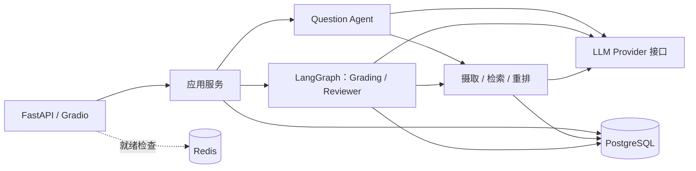

# EduAgent

[English](README.md) | [简体中文](README.zh-CN.md)

基于 RAG、结构化 AI 输出与人工复核的教学评测项目。

EduAgent 连接课程资料、题目准备、学生答卷、评分与学习反馈。教师审核 AI 生成的候选题，并复核低置信度评分；学生查看基于已确认成绩生成的结果与诊断。

Gradio 界面按角色提供工作台，主要使用中文。

## 项目状态：v2.0

**`v2.0` Git 标签**对应 2026-10-07 已验收的学习项目交付版本。T134–T191 共 58 项任务按已确认口径完成。`pyproject.toml` 的包版本仍为 `0.1.0`，与 Git 交付标签分别追溯。

本版增加试卷导入与校正、CPU OCR、章节范围检索、原题改编与语义核验、条件组卷、本场分值、分析反馈及 Windows EXE 打包。[最终交付清单](docs/v2.0-delivery-checklist.md)汇总当前制品、验收证据、数据库状态与已知限制。复核时原业务库仍为 `0012_audit_logs`；发布源码不会自动升级现有数据库。

## 核心能力

- **课程知识摄取**：解析 PDF、TXT、Markdown，完成清洗、分块和 Embedding，保留处理状态及可追溯来源。
- **四种检索模式**：Vector Only、Keyword Only、Hybrid 加权分数融合、Hybrid + Rerank；结果保留课程、资料和片段标识。
- **AI 辅助题目准备**：生成结构化候选题，经过校验及教师审核后，才能用于可参加的考试。
- **题目依据持久化**：保存来源快照、实际生成元数据和多轮修订意见，可跨请求读取；来源片段删除后保留历史快照，并在界面明确标注。
- **阅卷**：客观题由确定性规则评分，不调用 LLM；主观题结合课程上下文，经过 JSON/Pydantic 校验及可配置的置信度检查。
- **人工复核与恢复**：LangGraph 按题路由，待复核时暂停，教师作出决定后从持久化检查点恢复。
- **成绩与诊断**：区分待复核和最终成绩；诊断仅使用已接受或人工复核的评分，过期报告标记为 Stale。
- **角色边界**：后端执行 Teacher、Student、Admin 权限检查，管理员不能代替教师审核题目或复核评分。
- **工程支撑**：站内 JWT 授权工具、审计日志、Agent/Workflow Trace、可复现 Benchmark、幂等演示种子。评测看板要求显式读取授权。

## v2.0 新增能力

- **试卷导入与校正**：支持文字、扫描、混合 PDF 及图片；对照原页校正结构化题目，支持拒绝与幂等确认入库。选项用 JSON 保留键顺序，未知答案、边界和图像资产保留真实未知状态。
- **本地 CPU OCR**：RapidOCR 3.9.2＋ONNX Runtime 1.30.0，使用外置 PP-OCRv5 mobile 权重。OCR 显式开启，不可用或提取失败时保留真实错误；试卷源卷不进入教学资料检索。
- **章节与知识点范围**：确认章、节定位与片段标签，出题和阅卷显式传入检索范围。知识点继续保存在 JSONB metadata 中。
- **原题改编与审核**：支持导入题改编、独立配置图像模型进行理解、持久化语义核验报告；审核要求当前修订核验通过，输入变化后旧证据失效。题图默认不对学生开放，源卷和含答案整页永久私有。
- **条件组卷与本场评分**：按教学要求选题，展示缺口，调整题序、替换题目，设置本场分值和 Rubric。组卷条件记录意图，实际题序与分值以 `ExamQuestion` 为准，发布时冻结评分依据。
- **考情与学习反馈**：教师查看成绩分布、逐题结果、知识点失分和关注名单；学生查看答案反馈及有真实课程来源的推荐。待复核、失败、资料不足分别展示。
- **持久文件与 Windows 交付**：文件登记、显式历史迁移、数据库与关联文件同集备份及隔离恢复；PyInstaller onedir 包使用外置配置和业务数据。

## 架构



PostgreSQL 保存业务数据、pgvector 向量、全文检索数据和 Workflow 检查点。Redis 属于运行基础设施，不承担阅卷检查点存储。Compose 包含 `postgres`、`redis`、`backend` 三个服务，不要求独立 Worker、Milvus 或 Elasticsearch 服务。

| 层次 | 实现 |
| --- | --- |
| API 与演示界面 | FastAPI、Gradio |
| 校验 | Pydantic Schema 与领域 DTO |
| Workflow | LangGraph、持久化状态与人工复核 |
| 持久化 | SQLAlchemy、Alembic、PostgreSQL 16 |
| 检索 | pgvector、PostgreSQL `tsvector`/GIN |
| 模型接入 | Provider 抽象、DeepSeek 适配器与 OpenAI-compatible 客户端 |
| 默认本地 Embedding | `BAAI/bge-large-zh-v1.5`，1024 维 |
| Rerank | LLM 适配器或可选的本地 Cross Encoder |

## 实现原理

### 从课程资料到检索上下文

[摄取管道](backend/app/ai/ingestion/service.py)依次解析资料、清洗文本、切分片段，并调用 Embedding Provider 生成向量。知识库服务将片段、来源元数据和向量写入 PostgreSQL，检索时限定在请求的课程范围内。

| 模式 | 实现方式 |
| --- | --- |
| `vector_only` | 将查询转换为向量，通过 pgvector 查找语义相近的片段 |
| `keyword_only` | 使用 PostgreSQL 全文检索匹配关键词 |
| `hybrid` | 分别归一化向量分数与关键词分数，再按可配置权重融合 |
| `hybrid_rerank` | 对混合检索的候选片段调用选定的 Rerank Provider 重排 |

[混合检索器](backend/app/ai/retrieval/hybrid_search.py)保留来源标识和分数，供出题与阅卷引用依据。PostgreSQL 的 `simple` 全文检索配置不进行中文分词，语料语言和查询表达会影响关键词匹配。

### 结构化 Agent 与出题

Agent 之间使用有类型约束的输入、输出传递信息，而不是自由文本。各模块的职责如下：

| Agent | 职责 |
| --- | --- |
| Question | 根据课程上下文生成结构化候选题，交由校验与教师审核 |
| Grading | 编排客观题、主观题评分并返回结构化结果 |
| Reviewer | 检查结果的结构一致性，提出接受、修订或重评建议，不替代教师决定 |
| Supervisor | 根据显式任务类型和状态快照作出确定性路由决策；阅卷执行路径由 LangGraph 图控制 |

[Question Agent](backend/app/ai/agents/question_agent.py)调用实际解析的 LLM Provider，生成结果进入校验流程。[生成服务](backend/app/api/question_generation.py)在同一事务中写入整批题目、来源快照和生成元数据。Provider 与模型身份来自实际实例，不根据配置猜测；教师审核是独立操作。

来源快照保存生成时使用的文本。原始片段删除后，实时引用置空，但快照保留为历史依据；多轮修订意见与题目的审核记录一同持久化。

### 可暂停、可恢复的阅卷图

[阅卷工作流](backend/app/ai/workflows/grading_workflow.py)通过显式节点和条件边逐题处理答卷：

1. `load_submission`、`classify_question` 加载答卷并按题型选择评分分支。
2. `objective_rule_grade` 使用确定性规则评分；`subjective_retrieve_grade` 将课程检索上下文与评分请求一起交给 LLM。
3. `structured_validation` 校验结果结构，`confidence_check` 决定接受结果或进入人工复核。
4. `pending_review` 通过 LangGraph 原生 interrupt 暂停。教师可以确认、修改或要求重评；持久化检查点使同一工作流能跨请求恢复。
5. `next_answer` 推进到下一题，`unified_result` 汇总成绩，满足最终化条件后由 `generate_diagnosis` 生成学习反馈。

[检查点服务](backend/app/services/workflow_checkpoint.py)将图状态保存到 PostgreSQL。业务结果落库和复核决定使用数据库事务，待复核分数不作为最终成绩展示；复核轮次标识用于区分同一次决定的重试与新一轮复核。

启动请求会执行图直到暂停或结束，因此响应时间包含模型调用耗时；查询请求读取已持久化的工作流状态。

### Provider、权限与可观测性边界

LLM、Embedding、Rerank 使用独立接口。[LLM Provider 接口](backend/app/ai/llm/base.py)提供结构化生成和模型元数据，调用方可注入 Provider，而不改变评分规则或图结构。Rerank 失败会显式返回，不静默切换算法。向量表使用 1024 维结构，更换 Embedding 模型后需要重新摄取受影响资料。

[JWT 认证与权限层](backend/app/core/security.py)确定调用者身份，领域服务校验课程归属及成绩读取权限。Teacher、Student、Admin 是不同角色，管理权限不等于教师专属 AI 业务权限。

`mcp/` 提供站内 JWT 授权的工具调用边界，不是外部 MCP 传输；工具将可信调用者传入现有服务。邮件适配器可以替换，默认返回 `not_configured`，不将未发送的邮件标记为成功。

AuditLog 记录脱敏后的业务操作；AgentRun、WorkflowRun 通过请求与工作流标识关联模型调用和图执行。Trace 排除凭据、完整 Prompt 和学生答案原文。显式维护方法按 180 天清理审计日志、按 30 天清理 AgentRun Trace，不删除用于恢复的 WorkflowRun 状态。

## 快速开始

主路径采用 **Docker 运行 PostgreSQL、Redis，本机运行 Python 后端**，并安装默认本地 BGE 所需的可选依赖。

### 1. 准备代码与环境

前置条件：Git、Python **3.12+**、支持 Compose v2 的 Docker、下载依赖和模型权重所需的网络，以及执行真实 AI 操作所需的有效 DeepSeek API Key。

在 PowerShell 中执行：

```powershell
git clone --branch deepcode https://github.com/MiracleYjx/EduAgent.git
cd EduAgent
python -m venv .venv
.\.venv\Scripts\Activate.ps1
python -m pip install -e ".[dev,rerank-local]"
Copy-Item .env.example .env
$env:HF_HOME = Join-Path (Get-Location) ".cache/huggingface"
```

已有工作区可跳过克隆，并保留原有 `.env`。macOS/Linux 用户将激活环境、复制配置和设置缓存的命令替换为：

```bash
source .venv/bin/activate
cp .env.example .env
export HF_HOME="$PWD/.cache/huggingface"
```

`rerank-local` 提供 `sentence-transformers`，供 BGE Embedding 和可选 Cross Encoder 共用。首次使用模型时会下载权重，请预留时间和磁盘空间。在启动后端的同一终端中设置 `HF_HOME`，即可复用项目内缓存。

扫描试卷导入还需安装 OCR 扩展（`python -m pip install -e ".[ocr]"`），设置 `OCR_ENABLED=true`，并在 `OCR_MODEL_DIR` 预置三份 PP-OCRv5 mobile 权重。具体见 [OCR 选型与配置](docs/evaluation.md)及[试卷导入指南](docs/paper-import.md)。下文 Windows 构建已包含 OCR 运行库，权重仍需外置。

### 2. 配置环境变量

生成 JWT 签名密钥，将输出粘贴到 `.env`：

```powershell
python -c "import secrets; print(secrets.token_urlsafe(32))"
```

以下配置对应未修改的本地 Compose 数据库与 Redis 默认值。替换两处密钥占位符，其他可选设置沿用 [.env.example](.env.example)。

```dotenv
DATABASE_URL=postgresql+psycopg://eduagent@127.0.0.1:5432/eduagent
REDIS_URL=redis://127.0.0.1:6379/0
LLM_PROVIDER=deepseek
DEEPSEEK_API_KEY=<your-deepseek-api-key>
DEEPSEEK_BASE_URL=https://api.deepseek.com
DEEPSEEK_MODEL=deepseek-chat
EMBEDDING_PROVIDER=huggingface
EMBEDDING_MODEL=BAAI/bge-large-zh-v1.5
EMBEDDING_DIMENSION=1024
RERANK_PROVIDER=llm
RERANK_MODEL=deepseek-chat
CONFIDENCE_THRESHOLD=0.80
JWT_SECRET_KEY=<paste-generated-secret>
DEV_MODE=true
```

`JWT_SECRET_KEY` 至少需要 32 个字符。这里显式开启 `DEV_MODE=true` 以便本地演示，仓库默认值为 `false`。不要提交 `.env`。

Compose 数据库采用 trust 认证，并将端口绑定到本地回环地址，仅面向本地开发，不是生产部署配置。如果修改过数据库凭据或映射端口，应相应调整本机连接地址。

### 3. 启动依赖、迁移数据库并运行

```powershell
docker compose up -d --wait postgres redis
python -m alembic upgrade head
python -m uvicorn backend.main:app --host 127.0.0.1 --port 8000
```

登录或创建业务数据前先执行迁移。如果 Compose 后端已经占用 8000 端口，先执行 `docker compose stop backend`，再启动本机后端。

如需演示内容，可在**迁移完成后、启动后端前**，于同一虚拟环境中执行：

```powershell
python scripts/demo_seed.py
```

种子脚本要求 `DEV_MODE=true` 且 Embedding Provider 可用；上述开发模式使用本地 BGE，首次运行可能下载权重。重复执行会复用演示账号、课程、知识库、题目和考试，不创建学生答卷。

| 入口 | 地址 | 用途 |
| --- | --- | --- |
| 演示界面 | `http://127.0.0.1:8000/gradio/` | 按角色使用工作台 |
| API 文档 | `http://127.0.0.1:8000/docs` | 查看并调用接口 |
| 存活检查 | `http://127.0.0.1:8000/health` | 检查进程是否存活 |
| 就绪检查 | `http://127.0.0.1:8000/ready` | 检查配置、PostgreSQL 和 Redis |

就绪检查成功不代表模型凭据、模型权重或完整 AI 工作流已经验证通过。

### 4. 本地演示登录

开启开发模式后，点击管理员、教师或学生快速登录按钮。界面会准备 `dev_admin`、`dev_teacher`、`dev_student` 账号并签发标准 JWT，没有统一的默认密码。

如需通过密码使用 API，可在管理员工作台创建用户，调用 `POST /api/auth/login`，再携带返回的 Bearer Token 访问受保护接口。关闭开发模式不会删除演示账号，也不会撤销已有令牌；部署前需另行处理这些账号的访问权限。

### 备选：在 Docker 中运行后端

当前 [Dockerfile](Dockerfile) 安装项目运行依赖（`pip install .`），**不包含本地 BGE/Cross Encoder 依赖**。Docker Demo 通过 `DEMO_EMBEDDING_MODEL`、`DEMO_EMBEDDING_BASE_URL`、`DEMO_EMBEDDING_API_KEY` 配置云端 `openai_compatible` Embedding；模型须实际返回 **1024 维**向量。镜像不内置密钥，也不会在云端不可用时自动切换本地模型。

完成 Provider 配置后，可用下面的方式代替本机后端：

```powershell
docker compose build backend
docker compose up -d --wait postgres redis
docker compose run --rm --no-deps backend python -m alembic upgrade head
docker compose up -d --wait backend
```

Compose 会提供容器内部的 PostgreSQL 与 Redis 地址。启动容器前先停止占用同一端口的本机后端。更方便的演示入口是先在 `.env` 启用 `DEV_MODE=true` 并填写云端配置，再运行 `./scripts/run_demo.ps1`；它启动三容器、迁移并幂等灌入课程、知识库、题目和考试。健康检查不等于 AI 链路验收，脚本可能产生云端模型费用。

资料摄取和 AI 操作需要真实可用的 Provider 配置，密钥占位符不能生成向量。

## 打包与运行 Windows EXE

在 Windows 上准备 **Python 3.12+**，于项目根目录运行现有[构建脚本](scripts/build_exe.ps1)。下面的构建包含本地 BGE/Cross Encoder 推理库：

```powershell
.\scripts\build_exe.ps1 -WithLocalModels
```

脚本会创建独立构建环境，安装 `packaging/requirements-windows.txt`，使用 `packaging/EduAgent.spec` 构建。输出为 **`.cache/exe-build/dist/EduAgent/`**，包含 `EduAgent.exe`、`_internal/`、配置模板和 `build-receipt.json`。交付时复制**整个目录**。GitHub 标签提供源码，上述命令在本机生成二进制包。

如果只用云 Embedding，省略 `-WithLocalModels`，配置真实可用的 1024 维 Embedding 服务。本地推理库不包含模型权重；BGE/Cross Encoder 及启用 OCR 时的完整权重目录需要另行准备，Windows 启动器不会自动下载。

另行准备 PostgreSQL＋pgvector 和 Redis。创建外置配置，并保留已有配置文件：

```powershell
$taskConfigDir = Join-Path $env:LOCALAPPDATA 'EduAgent'
New-Item -ItemType Directory -Path $taskConfigDir -Force | Out-Null
$taskConfigFile = Join-Path $taskConfigDir 'config.env'
if (-not (Test-Path -LiteralPath $taskConfigFile)) {
    Copy-Item .\config\windows.env.example $taskConfigFile
}
notepad $taskConfigFile
```

填写数据库、Redis、JWT 密钥、模型凭据及目录。使用本地 Embedding 时，设置 `EMBEDDING_PROVIDER=local`、`EMBEDDING_MODEL=<完整外置模型目录>`；使用云端时保留 `openai_compatible` 并填写其模型、地址和独立凭据。需要演示快速登录时才显式设置 `DEV_MODE=true`。

已有数据库先备份，确认所连接的目标库后启动：

```powershell
& .\.cache\exe-build\dist\EduAgent\EduAgent.exe --config $taskConfigFile --no-browser
```

启动器检查依赖、执行必要迁移后开放服务。就绪后访问 `http://127.0.0.1:8000/gradio/`；省略 `--no-browser` 会自动打开页面。Ctrl+C 停止所属应用进程。目标机器无需 Python；配置、权重及业务数据放在包外，默认业务目录为 `%LOCALAPPDATA%/EduAgent/storage`。

详见[部署指南](docs/exe-deployment.md)、[包内说明](packaging/README.md)和[当前交付清单](docs/v2.0-delivery-checklist.md)。部署证据保留了早期失败段落，当前启动结论以 T189 最终结果为准。新构建应另行验证，构建回执用于追溯，不替代验收。

## 教学评测流程

结合 Gradio 页面和 API 文档，按以下流程操作。空数据库不会自动预置数据：开发模式可执行 `python scripts/demo_seed.py`；Docker Demo 在云端 Embedding 配置完成后执行 `./scripts/run_demo.ps1`。两种种子入口均不创建学生答卷。

1. **教师**：创建课程及其知识库，上传受支持的资料，确认处理状态达到 `Ready`。
2. **教师**：手工创建题目或根据课程资料生成 AI 候选题；审核通过后再加入考试。
3. **学生**：打开可参加的考试并提交答案，一份考试可组合单选、判断和简答题。
4. **教师**：调用 `POST /api/workflow/submissions/{submission_id}/runs` 启动 LangGraph 阅卷，通过 `GET /api/workflow/runs/{workflow_id}` 查询状态。
5. **教师**：通过复核工作台或 API 确认、修改低置信度评分。如果结论已保存但恢复失败，调用 `POST /api/workflow/runs/{workflow_id}/resume` 继续原运行。
6. **学生／教师**：查看已确认成绩和诊断；待复核状态不得被展示为最终成绩。

独立的 `/api/grading` 任务 API 使用后台任务检查点，不能替代 LangGraph 运行检查点；暂停与恢复应使用 `/api/workflow` 路径。

## 测试

使用开发或测试数据库。PostgreSQL 测试需要可连接的数据库、pgvector 及相应表结构；前置条件不可用时，测试会报告跳过。

项目门禁使用 Mypy 和 Ruff，但当前 `dev` 依赖组未包含这两个工具，需要单独安装后执行三项检查：

```powershell
python -m pip install mypy ruff
python -m pytest tests/ -q
python -m mypy backend/app/
python -m ruff check backend/ tests/
python -m alembic current
python -m alembic check
```

容器冒烟测试要求隔离设置：`COMPOSE_PROJECT_NAME=eduagent-test`、`POSTGRES_PORT=15432`、`REDIS_PORT=16379`、`BACKEND_PORT=18000`，具体见[测试前置条件](tests/integration/test_m0_smoke.py)。

## 评测

### v2.0 已记录验收

T146/T168 的基准为 **AI 辅助标注＋开发者审查**，使用合成试卷，无独立教师标签。T168 正式采用 v8 的五份试卷、三轮实测：16 道不同参考题，共 48 个评测实例；题型未知的原始实例排除，该字段分母为 45。

| 字段组 | v8 实测 | 目标 |
| --- | --- | --- |
| 身份、题号、题序、来源页、选项、参考答案、分值 | 各 48/48（100%） | 100% |
| 题型 | 45/45（100%） | 已知标签 100% |
| 题干 content | 40/48（83.33%） | ≥80% |
| 解析 analysis | 41/48（85.42%） | ≥80% |
| 评分标准 scoring_rubric | 42/48（87.50%） | ≥80% |
| 知识点 knowledge_points | 43/48（89.58%） | ≥70% |

图片资产不计入这些阈值：自动图像提取尚未实现，未知资产不等于已确认无图。[v8 字段证据](benchmark/results/v2/t168-bounded-20261007/round2-fields/summary.json)取代 v6 的当前验收结论，历史结果保留。

最终 Windows 包首次三次启动 **9.005–9.670 秒**，后续五次 **8.307–8.865 秒**，均达到 `/ready` 与 `/gradio/` 双端点就绪；启动资源窗口、正常退出各 8/8 通过。这是依赖已准备的本机测量，不含浏览器渲染和长时模型负载。见[启动证据](benchmark/results/v2/t189-optimize-20261007/README.md)、[评测文档](docs/evaluation.md)与[验收报告](docs/validation-report.md)。本次 README 更新未重新运行这些检查。

### 阅卷管道自检

完成环境配置后，可运行确定性替身自检，无需真实模型调用或已持久化的检索语料：

```powershell
python scripts/run_grading_benchmark.py --mode selftest
```

自检覆盖 Zero-shot、RAG、Hybrid + Rerank 三种策略，只验证管道行为，不证明评分质量。MAE、RMSE 与一致率需要教师人工标签；缺少标签时这些指标保持 `null`，不将合成参考分数当作人工标注。

### 可复现检索评测

检索 Benchmark 在隔离 schema 中初始化语料，使用 manifest 保存运行时的真实资料与片段 UUID，无需预置数据库标识。可先用替身验证可复现管道：

```powershell
python scripts/setup_benchmark_corpus.py --self-test --output-dir .cache/benchmark/corpus-stub
python scripts/run_retrieval_benchmark.py --self-test --manifest .cache/benchmark/corpus-stub/manifest.json --queries 999 --run-id stub-01 --output-dir .cache/benchmark/results
```

真实 Provider 的运行选项可通过各脚本的 `--help` 查看；`--self-test` 仅验证管道，不是质量结论。真实模型调用可能计费；失败与缺失指标不会伪装成零分，评测看板读取仍需显式授权。

小规模合成检索数据集和中文分词限制影响结论的适用范围。比较实验时，应同时核对数据集、模型、Prompt 和配置元数据；合成评分参考分不是教师人工标签。

## 已知限制

- 质量基准规模较小，使用合成数据及 AI 辅助标注，可验证已确认的学习项目流程；进一步验证质量提升需独立教师标注及更广泛数据。
- 语义条件误报仍为 **16.67%**（目标≤10%），语义 Rubric 覆盖 **77.78%**（目标≥90%），图片条件完整性 **72.73%**（目标≥95%）。这些指标与已通过的 v8 导入字段准确率不同，继续记录为限制。
- 自动检测、裁切及关联题图属于后续工作，自动提取 `assets` 为 0/48；当前图片理解与人工校正不代表自动图像提取流程已实现。
- 原业务库复核时有 0013–0023 共 11 个 v2.0 迁移未应用，源码单链 head 为 `0023_grading_exam_question`。现有环境升级前需备份、核对；隔离恢复验证不会自动切换业务环境。
- Windows 验收使用依赖已准备的本机，未覆盖纯净目标机安装。Docker 就绪与合成自检不能证明 Docker 云模型闭环或真实学校生产可用性。
- PostgreSQL `simple` 不做中文分词；Embedding 固定 1024 维，更换模型需重新摄取资料。模型质量、外部服务延迟与工作流响应时间应分别判断，不能用 EXE 启动耗时替代。

完整限制与测量边界见[最终交付清单](docs/v2.0-delivery-checklist.md)。

## 文档导航

| 文档 | 内容 |
| --- | --- |
| [最终交付清单](docs/v2.0-delivery-checklist.md) | v2.0 当前状态、制品、数据库及限制 |
| [试卷导入](docs/paper-import.md) | OCR、校正、题图与确认入库 |
| [文件生命周期](docs/file-lifecycle.md) | 持久文件身份与访问规则 |
| [存储操作](docs/v2.0-storage-operations.md) | 迁移、同集备份及隔离恢复 |
| [EXE 部署](docs/exe-deployment.md)／[包内说明](packaging/README.md) | 构建与启动配置 |
| [评测](docs/evaluation.md)／[验收报告](docs/validation-report.md) | 协议、当前结果及历史证据 |
| [测试变更记录](docs/test-change-record-v2.md) | 测试修改原因与覆盖 |

## 目录说明

```text
backend/
  main.py                 应用入口
  app/
    ai/                   摄取、Embedding、检索、Provider、Agent、Workflow
    api/                  HTTP 端点与 API 服务装配
    mcp/                  站内授权工具边界与适配器
    services/             业务服务、评分、复核、检查点
    models/               SQLAlchemy 持久化模型
    schemas/              Pydantic DTO
    ui/                   Gradio 页面与加载器
    core/                 配置、数据库、Redis、认证
migrations/               Alembic 迁移
scripts/                  启动／构建、存储维护、演示种子与评测执行器
packaging/                PyInstaller 清单、固定 Windows 依赖与构建回执
config/                   Windows 外置配置模板
docs/                     使用指南、验收证据与交付清单
tests/                    单元、契约与集成测试
benchmark/                评测语料、清单及结果记录
```
