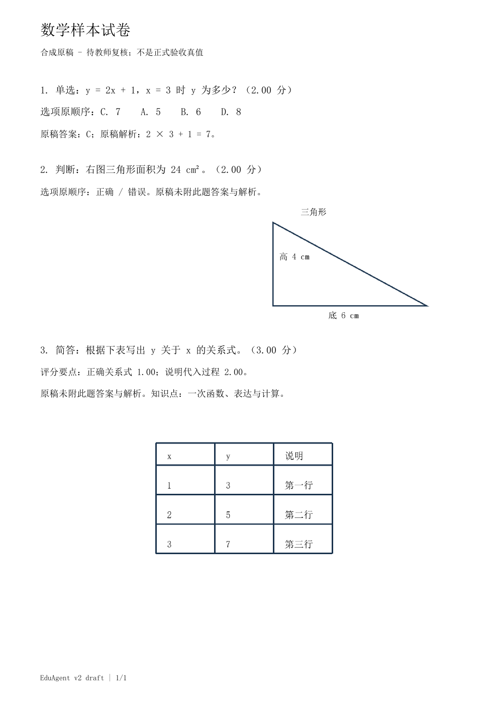
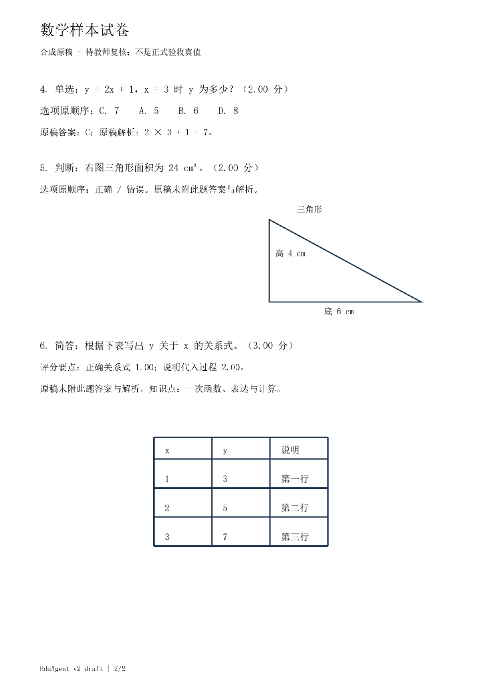
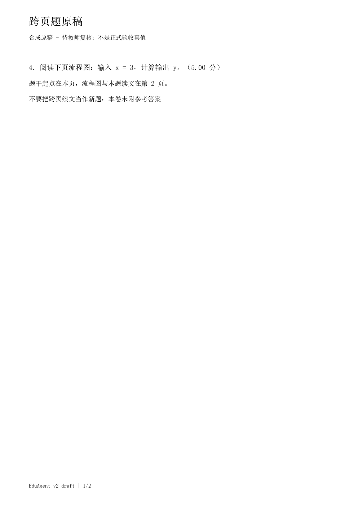
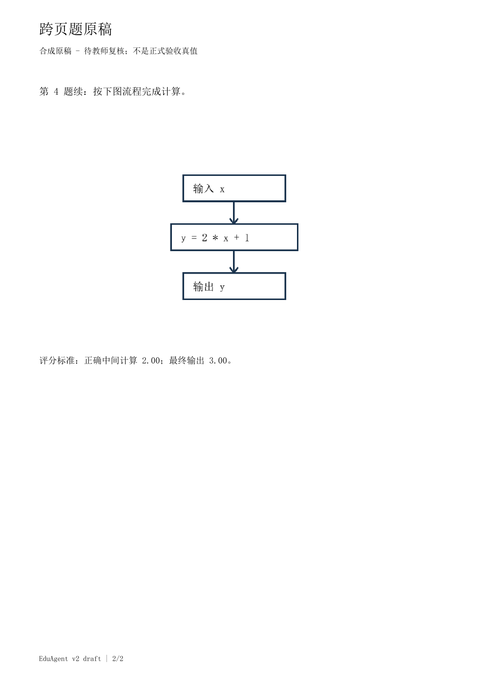

# T160 原稿逐字段标注草稿（用户授权、AI 代拟）

状态：`user_confirmed_ai_assisted`。这份标注由 Codex 实际查看原 PDF/PNG 后代拟，当前会话用户已明确确认“确认标注并采用 AI 辅助口径（推荐）”。人工确认人记录为 `current_chat_user`，身份种类 `human`，确认 UTC 为 `2026-10-02T16:14:48+00:00`；5 个 case 均已获本次人工会话确认。

实际作者仍为 AI，未虚构教师姓名、账户或独立教师阅读/标注时间。`teacher_id=null`、`teacher_verified=false`、`is_independent_teacher_truth=false`，独立教师标注数仍为 0。本批可采用已确认的 AI 辅助参考口径单列比对，不能宣称独立教师质量基准。

未修改原 `v2-draft-20261001` 包、既有标注或 `grading_samples.json`；没有 OCR/LLM 调用。文字 PDF 使用 Poppler 120 DPI 渲染视觉核对，并以 pypdf 提取文字辅助核字；扫描和试卷 PNG 直接核对原像素。四份 PDF 共六页和试卷 PNG 均已查看；三份独立题图也已查看。

## 1. 已确认的四种独特题目

| 原题 | 题干摘要 | 原稿明确提供 | 保持缺失/未知 |
| :--- | :--- | :--- | :--- |
| 单选 1（混合页 2 为 4） | y = 2x + 1，x = 3 时 y 为多少？ | 2.00 分；选项键序 C/A/B/D，对应 7/5/6/8；原答案 C；原解析“2 × 3 + 1 = 7。” | 评分标准、知识点未提供 |
| 判断 2（混合页 2 为 5） | 右图三角形面积为 24 cm²。 | 2.00 分；选项“正确 / 错误”；图中高 4 cm、底 6 cm | 原稿明确未附答案/解析；评分标准、知识点未提供。没有计算面积补答案 |
| 简答 3（混合页 2 为 6） | 根据下表写出 y 关于 x 的关系式。 | 3.00 分；评分要点“正确关系式 1.00；说明代入过程 2.00。”；知识点“一次函数、表达与计算”；表 x=1/2/3、y=3/5/7 | 原稿明确未附答案/解析；选项不适用。没有推导公式补答案 |
| 跨页题 4 | 阅读下页流程图：输入 x = 3，计算输出 y。/按下图流程完成计算。 | 5.00 分；实际来源 PDF 页 1、2；图在页 2；评分“正确中间计算 2.00；最终输出 3.00。”；流程“输入 x → y = 2 * x + 1 → 输出 y” | 原稿未标题型，保持 null；已确认其未知状态；未附答案/解析/知识点，无选项。没有代算输出 |

所有 `source_regions` 保持 null：真实来源页已核对，但未测量可靠题目/题图像素边界。不能从页图缩放尺寸推造原像素框。上述“原稿缺失”与“标注未知”分开保存；来源没有标注知识点时记空列表与 `known_missing`，不按题目内容推断知识点。

## 2. 五个正常 case 的独立题目实例

| case_id | 原文件 | 真实来源页与题号 | 数量 |
| :--- | :--- | :--- | ---: |
| IMP-TEXT | inputs/paper_text.pdf | PDF 页 1：1、2、3 | 3 |
| IMP-SCAN | inputs/paper_scan.pdf | PDF 页 1：1、2、3 | 3 |
| IMP-IMAGE | inputs/paper_image.png | 图片页 1：1、2、3 | 3 |
| IMP-MIXED | inputs/paper_mixed.pdf | PDF 页 1：1、2、3；PDF 页 2：4、5、6 | 6 |
| IMP-CROSS | inputs/paper_cross_page.pdf | PDF 页 1、2 是同一个第 4 题 | 1 |

合计 5 case、16 个题目实例、4 种独特题目。重复内容仍按原文件和题号保存为独立实例，不合并不同 case。跨页“第 4 题续”只合并到原第 4 题，不新增题目。

混合 PDF 第 1 页页脚印刷“1/1”，第 2 页印刷“2/2”；此处仍以 PDF 真实页序 1、2 为来源事实，不用页脚改写真实页号。

## 3. 题图关联与顺序

判断题关联 `assets/figure.png`（稳定 fixture UUID `839f8584-dff3-526a-8cbe-85ac6784a3e2`）；简答题关联 `assets/table.png`（`34fa6905-e80a-5a0f-a7fa-2abac6ba9850`）；跨页题关联第 2 页 `assets/diagram.png`（`31d1b223-0422-5f9f-b323-7ecac2ad4367`）。每题只有一张图，其顺序为 1；单选没有题图。这些 UUID 是草稿包的稳定资源身份，不冒充服务已登记 file_id。关联依据是实际查看原页与独立 PNG 的视觉对应，原文件和 PNG 的 SHA256 在 JSON 中保存。

## 4. JSON 字段口径

`annotations.draft.json` 记录每题稳定 UUID、原题号、一基题序、题型/题干、选项键序或有序列表、原答案/解析/分值/评分标准/知识点、真实文件/页号、题图顺序、源文件摘要、字段缺失或未知原因。

`known_missing` 为原稿没有提供且可明确核对的字段；`unknown` 为尚不能可靠确定的分类/边界；`not_applicable_fields` 为简答/跨页题没有选项。跨页题型 null 不等于机器判错；像素边界 null 不抹掉真实来源页。后续自动提取与教师校正结果必须保存为分开的快照，不能以校正后的值反向覆盖自动输出。

当前会话用户已确认五 case 的 AI 辅助标注，原文为“确认标注并采用 AI 辅助口径（推荐）”；确认人为 `current_chat_user`，`reviewer_kind=human`，UTC 为 `2026-10-02T16:14:48+00:00`。四种题目的原文摘录、原稿缺失字段以及题目/图片/页号关联按已确认标注固定；跨页题型与像素边界的未知状态继续保持 null，没有由确认动作补写源稿未提供的信息。独立教师数仍为 0，不把本次会话确认冒充教师独立标注。

## 5. 原页对照

### paper_text-1.png

### paper_mixed-1.png

### paper_mixed-2.png

### paper_cross_page-1.png

### paper_cross_page-2.png

