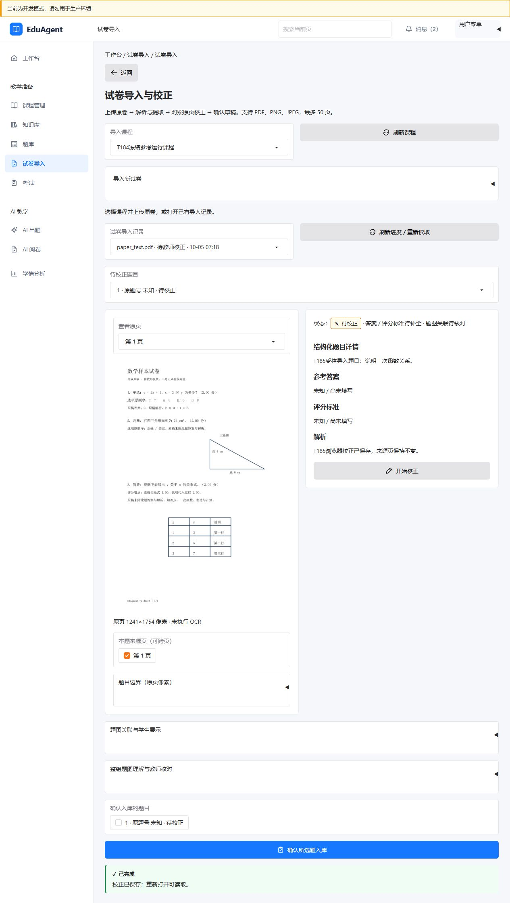
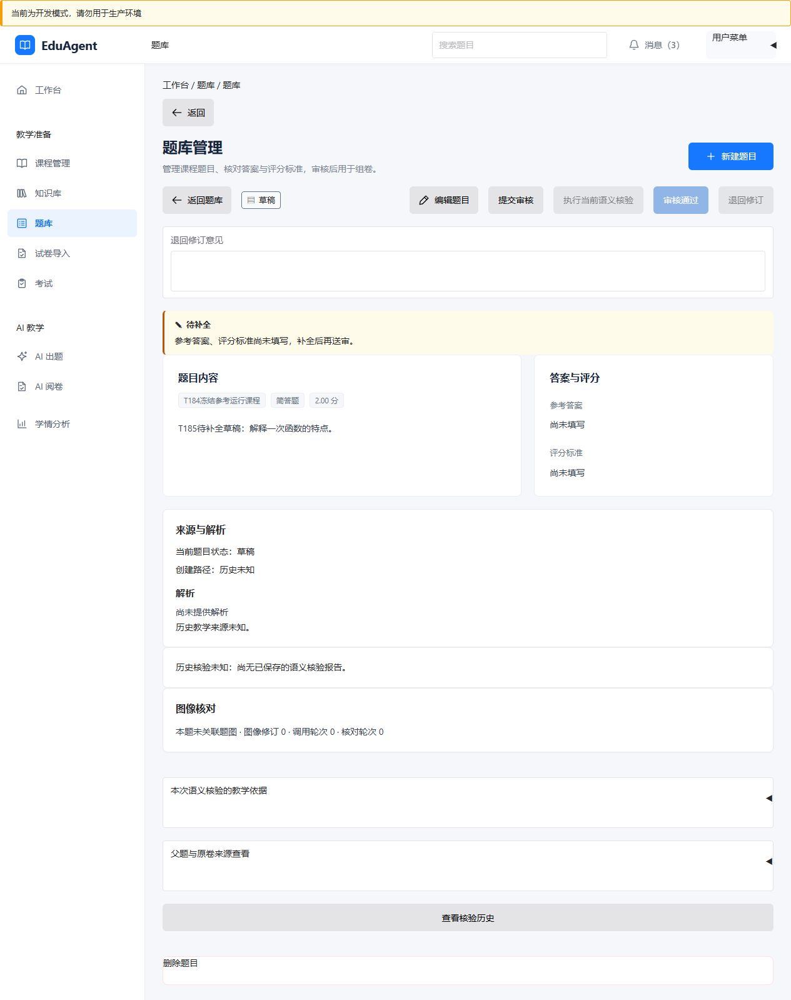
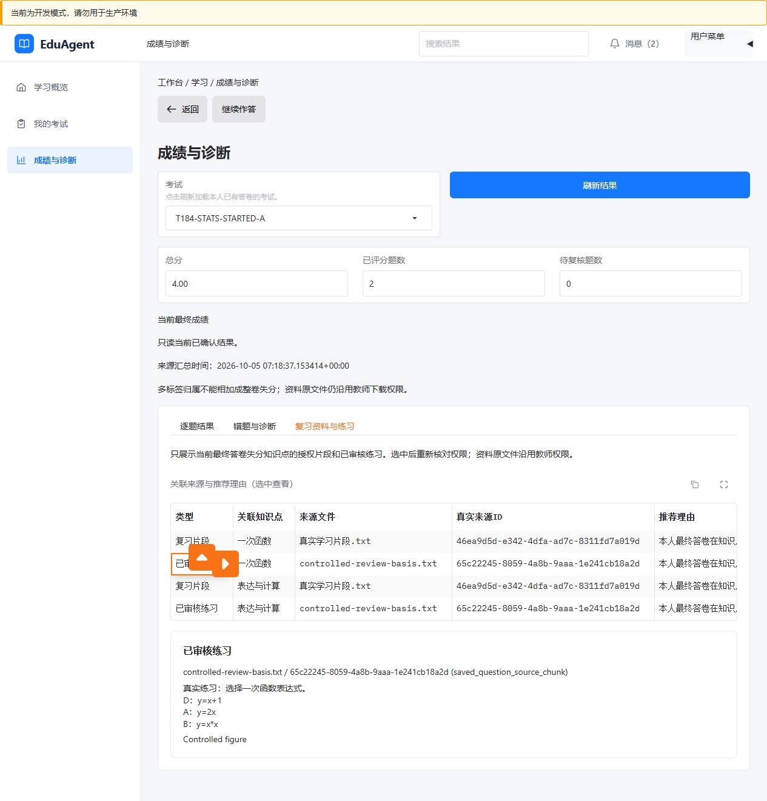

# v2.0 公共 UI 与三页样板验收（T185）

2026-10-05：导入校正、教师题库、学生诊断三页实际源码运行验收通过。主题/本地图标沿用原 Gradio 技术栈和完整角色工作台，没有增加前端依赖。本文件是 T186 七类页面验收的样板，不能代替 SC-014 完整 UI/EXE 验收。

## 公共规则

- 复用现有工作台导航、面包屑、列表→只读详情→显式编辑结构；表格保留真实状态，查看操作不写业务数据。
- 桌面正文 14px、主标题 24px、分节 16px；区域间距 16px、表面内边距 20px、动作按钮最低 44px。窄屏复用现有断点，配置单列原页/校正区；本批实测是 1280×720 桌面，没有宣称移动端或其他视口已验收。
- 使用现有语义状态组件，区分待校正、待补全、待教师审核、已审核、待人工复核、处理失败。错误保持真实详情并 HTML 转义，失败使用 alert；没有将错误改成空数据或成功。六状态语义及错误转义由新增聚焦用例验证。
- 状态说明来自实际 DTO/缺失字段，不新增业务状态。保存重新读取服务事实；取消恢复持久值。导入原页定位、资产与图片核对使用既有独立操作与校验。

## 三页操作结果

| 页面 | 实际操作 | 结果 |
| --- | --- | --- |
| 导入校正 | 教师登录、选课程/记录、开始校正、改题干后取消、重开、保存解析 | 左原页右详情；默认只读，显式打开编辑；取消未写入，保存后关闭编辑并显示实际解析；答案/评分标准仍未知 |
| 教师题库 | 查询列表、打开草稿、编辑/取消、保存解析 | 沿用列表/详情/编辑；待补全明确标识，旧审批资格不变；取消保留原题干，保存解析后返回详情 |
| 学生诊断 | 学生登录、刷新本人答卷、切换两考试、看诊断、打开已审核练习 | B/A 总分实际 8.00/4.00；本场分值及知识点归属真实；诊断未生成显示空态；推荐来源/理由和原选项序保持，每次查看重核权限 |

数据库回读确认两次取消没有覆盖原题干；两次保存解析已持久，空答案和 Rubric 未被自动补造。学生练习实际授权图像字节加载完成，是 8×6 小型控制夹具；不代表复杂题图或理解质量通过。

## 截图与验证

完整七张截图、操作/原始夹具、数据库事实及清理记录见 [证据目录](evidence/t185-20261005/README.md)。聚焦 pytest：67 passed / 0 skipped / 13 项既有框架警告，42.42 秒；Ruff/Black 七文件与 mypy 全后端 213 文件通过。

## 范围与后续

用户已批准的 AI 辅助＋开发者审查口径不变，独立教师覆盖 0；不宣称正式教师质量、完整 SC-013 或 T168 质量达标。仅勾选 T185；T186 按样板继续知识库、AI 出题/审核、考试、阅卷、教师分析等其余页面的实际操作和角色验收。T187 单机启动器可随后连续推进，再进入 T188 构建。
