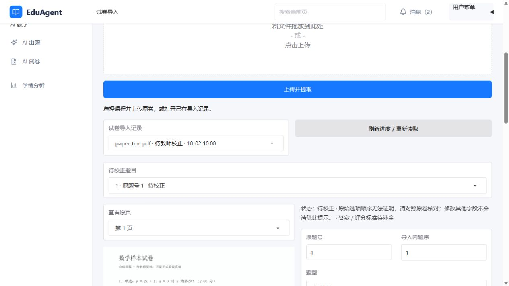

# EduAgent 端到端验证报告（开发模式 + 真实 DeepSeek 调用）

**验证日期**：2026-09-29（Asia/Shanghai）
**验证环境**：Windows 主机 Python 3.13.13 + Docker PostgreSQL/Redis；不是 Docker Demo。
**验证版本**：af04287b96429ceb44c07d48cebd427d1ad3163a（验证开始时的 HEAD）。
**结论**：部分成功。真实模型的检索重排、出题、混合阅卷、人工复核与诊断闭环均已运行；Workflow 冷启动 HTTP 延迟未达到 1 秒目标，Docker Demo 和三容器资源未验证。所有送往 api.deepseek.com 的资料仅来自 benchmark/corpus/ 的公开合成教材，以及本次构造的合成查询、题目和学生答案。未发送真实用户数据、生产业务数据或凭证；此授权仅用于本次 T089。

## 1. 启动验证与环境边界

| 项 | 结果 | 实测与说明 |
| :--- | :--- | :--- |
| PostgreSQL、Redis | ✅ | docker compose up -d postgres redis；两容器均 healthy。 |
| 主机 FastAPI | ✅ | 127.0.0.1:8000 启动，/ready 返回 HTTP 200。完成验证后停止；依赖容器保留。 |
| 数据库迁移 | ✅，有环境偏差 | 原 public schema 的 alembic_version 虽为 0012_audit_logs，却缺失 0011 的 question_source_chunks、question_generation_metadata、question_revision_comments；首次真实出题返回 HTTP 503，source_code=ProgrammingError。没有修改 public。新建隔离 schema t089_e2e_20260929 后执行正式 alembic upgrade head，各表存在且 revision=0012_audit_logs；后续链路均在此 schema 运行。 |
| 演示资料 | ✅ | T087 种子资料在开发库为 Ready，但它位于 scripts/demo_materials/，不属于本次对外发送授权。本次模型链路改用隔离 schema 中已摄取的 benchmark/corpus/python_basics.md，状态 Ready。 |
| Docker Backend 容器 | 未执行 | 开发模式只启动依赖容器，云端 DEMO_EMBEDDING_* 未配置。 |

## 2. 四种检索模式

使用 benchmark/corpus/ 的 Python 合成教材和 20 条合成查询。setup_benchmark_corpus.py 在隔离 schema 摄取并生成运行时 UUID manifest；本地 BGE 为 BAAI/bge-large-zh-v1.5，Hybrid + Rerank 的真实重排器为 LLMRerankAdapter，实际 LLM Provider 元数据为 deepseek / deepseek-chat。下表是 provider_run，不是 selftest；标注并非教师人工 Ground Truth，指标仅适用于该合成数据集。

| 模式 | Recall@5 | MRR | nDCG@10 | 检索 p95（ms） | 结果 |
| :--- | ---: | ---: | ---: | ---: | :--- |
| keyword_only | 0.000 | 0.000 | 0.000 | 3.814 | 真实运行，召回为零，不美化。 |
| vector_only | 1.000 | 0.975 | 0.96549 | 9.748 | 真实本地 BGE。 |
| hybrid | 1.000 | 0.975 | 0.96549 | 14.910 | 真实本地 BGE。 |
| hybrid_rerank | 1.000 | 1.000 | 0.99197 | 1320.482 | 真实 DeepSeek LLM Rerank；20 条查询。 |

manifest：.cache/benchmark/t089-20260929/corpus/manifest.json；真实结果 JSON/CSV：.cache/benchmark/t089-20260929/results/t089-local-01/ 与 t089-rerank-01/。这些是本机忽略文件，不随报告提交。另有 t089-stub-01/ 的 pipeline_selftest，仅证明管道可运行，不计入上表质量结论。

## 3. 候选审核

在仅包含 benchmark/corpus 教材的课程中，Teacher 通过 POST /api/question-generation/candidates 真实生成 1 道 SHORT_ANSWER 候选题，模型 deepseek-chat，来源快照 1 条且 sources_persisted=true；候选状态为 Pending Review。未审核时将其加入考试返回 HTTP 422；Teacher 经 POST /api/question-generation/candidates/{id}/review 审核后状态变为 Approved（HTTP 200），随后考试创建 HTTP 201、发布 HTTP 200。验证了 AI 候选不会自动发布。首次在 public schema 的 HTTP 503 属于上述迁移状态不一致，未计为出题成功。

## 4. 混合阅卷

同课程考试包含 1 道单选与 1 道 AI 生成简答。Student 经 POST /api/exams/{id}/submit 提交合成答案，状态 Submitted。默认 CONFIDENCE_THRESHOLD=0.80 下，Teacher 经 POST /api/workflow/submissions/{id}/runs 启动真实 LangGraph：HTTP 200，10.317 秒，Workflow Completed。持久化逐题结果为单选 5/5（置信度 1.00）、简答 4/5（置信度 0.95）；整卷 is_final=true，总分 9/10。此答卷未进入复核队列，不能将它声称为低置信度用例。

## 5. 人工复核与 Workflow 恢复

第二份合成考试/答卷仅用于复核分支。主机 FastAPI 进程临时设置 CONFIDENCE_THRESHOLD=0.99，未修改 .env 或业务代码；该配置与默认 0.80 明确区分。真实模型给简答题置信度 0.98，低于该验证阈值。启动 HTTP 200，19.122 秒，Workflow Paused、current_node=pending_review、resumable=true；GET /api/reviews/queue 返回 1 条，详情中含当前 review_round_id。Teacher 经 POST /api/reviews/decisions 提交带轮次 ID 的 Confirmed：HTTP 200，3.196 秒，decision_saved=true、resume_status=succeeded、Workflow Completed、pending_review_count=0。该 API 自动恢复原图，无需再调用单独的 resume 端点。新 Session 读到 ExamResult.is_final=true、10/10，Submission.status=Reviewed 且 reviewed_at 已写入。

## 6. 诊断生成与读取

第一份 9/10 答卷和复核后的第二份 10/10 答卷均有持久化 Ready 诊断。第二份通过学生 GET /api/results/me/submissions/{id}/diagnosis 返回 HTTP 200、Ready、4 条学习建议；教师授权结果详情 API 返回 HTTP 200、is_final=true，生产 results_loaders.load_teacher_diagnosis 返回 Ready、final=true。学生结果 API 返回 total_score=10.00、pending_review_count=0。未用 GET 请求生成新的诊断。

## 7. 资源使用

以下为真实模型调用后的一个空闲时刻快照，不是峰值或负载测试；Docker 容器内存与 Windows 主机 RSS 口径不同，不相加为三容器指标。

| 服务/进程 | CPU | 内存 | 说明 |
| :--- | ---: | ---: | :--- |
| PostgreSQL 容器 | 0.00% | 153.9 MiB | docker stats --no-stream。 |
| Redis 容器 | 1.38% | 6.992 MiB | 同上。 |
| 主机 Uvicorn worker | 约 1.04% 单核等效 | 1798.95 MiB RSS | 3 秒 CPU 差值；已加载本地 BGE。 |
| 三容器合计 | 无数据 | 无数据 | 未启动 Backend 容器，不伪造合计。 |

## 8. P95 响应阈值

主机本地 HTTP，单客户端串行，每个 GET 端点预热 1 次、采样 50 次，以最近秩法取 p95；非并发压力或 SLA 证明。Workflow 冷启动仅有 2 次真实模型调用，p95 为该小样本最大值，不能推断稳定吞吐。

| 端点类型 | 目标 | 实测 | 结果 |
| :--- | :--- | :--- | :--- |
| /ready | < 1.5 s | p95 77.961 ms，50/50 HTTP 200 | ✅ |
| GET /api/courses | < 1.5 s | p95 39.376 ms，50/50 HTTP 200 | ✅ |
| GET /api/exams?course_id=… | < 1.5 s | p95 42.876 ms，50/50 HTTP 200 | ✅ |
| 学生结果 GET（无模型等待） | < 3 s | p95 62.168 ms，50/50 HTTP 200 | ✅ |
| Workflow 查询 GET | < 1 s | p95 59.483 ms，50/50 HTTP 200 | ✅ |
| Workflow 冷启动 POST | < 1 s | 10.317 s、19.122 s；n=2，最近秩 p95 19.122 s | ❌；当前请求同步等待模型。 |

## 9. 未执行的验证项与遗留问题

| 项 | 原因 | 建议 |
| :--- | :--- | :--- |
| Docker Demo 端到端与三容器健康 | 本次按授权使用主机 Python + 两个依赖容器；云端 DEMO_EMBEDDING_* 未配置。 | T091 或独立任务配置可用的 1024 维云端 Embedding 后补验。 |
| 三容器合计资源与峰值资源 | 未运行 Backend 容器，也未进行持续资源采样。 | Docker Demo 补验时采集。 |
| 稳定的 Workflow 冷启动 P95 | 仅 2 次真实模型调用；不足以代表负载分布。 | 独立性能任务确定样本量、并发与预算；当前 <1 秒目标已被两次实测否定。 |
| public schema 迁移状态不一致 | 标记 0012 但缺失 0011 三表；隔离 schema 已完整迁移，public 未改动。 | T091 前单独审计、备份并按迁移方案修复，勿直接视为健康。 |

Workflow 恢复时 LangGraph 还发出“checkpoint 反序列化未注册类型，未来版本可能阻止”的告警；本次实际恢复成功，未在验证任务中修改 Checkpointer，建议后续兼容性检查。

**总体判定**：T089 已记录真实成功、失败及未执行项，开发模式闭环部分成功；不能据此宣称 Docker Demo 或性能门禁通过。

**后续处理（2026-09-29，T091.1）**：上述 `public` 缺少 0011 三表的偏差已按原迁移定义补建，原有数据保留；`alembic current` 与 `alembic check` 均通过。详见 [最终门禁修复记录](release-checklist.md)。本报告中的 T089 历史实测与其他遗留项保持原义。

## 10. T143：v1.0 基线复验（2026-10-01）

**结论**：T143 的复验、失败分类和建议记录已完成。当前工作区全量 pytest、mypy、ruff，以及隔离 PostgreSQL 的既有迁移检查通过；独立 Docker M0 运行退出码为 1，当前源码镜像构建被取消，Backend 未创建，三容器 healthcheck 和 Backend readiness 未获通过证据。因此，本节不宣称 Gate 1 或系统验收成功，也不覆盖前九节的历史结果。

### 10.1 版本、工作区与证据边界

- 复验起点：2026-10-01T21:31:28.100870+08:00；仓库 `D:\YJX\MyCode\EduAgent`，分支 `deepcode`，源码 HEAD 为 `d66371c8cacfc1c5f549765e349bfe78cafe576e`（T141 文档提交）。检查期间没有切换分支或改写源码。
- HEAD 无直接 tag；`git describe --tags --always` 为 `v1.0.0-m5-complete-20-gd66371c`。M5 tag 的实际提交为 `e1dfb3fd934041cfbd1d3873cd69a0f09e3967f0`；附注 tag 对象为 `7b04bdf4cb4dab25fd4d1f7f4556824f71c95b2a`，二者含义不同。
- 开始时已有 6 个已跟踪文件修改：`README.md`、`README.zh-CN.md`、`backend/app/ui/gradio_app.py`、`backend/app/ui/layout_view.py`、`backend/app/ui/question_view.py`、`tests/unit/ui/test_gradio_app.py`；另有 2 个未跟踪文件：`backend/app/ui/design_system.py`、`tests/unit/ui/test_question_bank_view.py`。这些用户改动原样保留，不纳入 T143 提交。
- 全量检查针对上述实际工作区，包含未提交 UI 和测试，因此不能把 1576 项通过直接声明为纯已提交 HEAD 的全量结果。为核实 T133，另用 `git archive HEAD` 导出到本次缓存目录，仅运行相关 28 项原有检查；没有 checkout、stash、reset 或复制私有配置文件。
- T133 提交 `ae1dab9` 至当前 HEAD 的 `backend/`、`tests/`、`migrations/`、`scripts/`、`Dockerfile`、`docker-compose.yml` 和 `pyproject.toml` 的 Git 差异为空；本次没有修改业务代码、配置、依赖、迁移或测试，不新增 TCR，不改旧任务状态。
- 本节只追加验证记录，原有 T089 正文和后续修复说明逐字节保留。本文件原先受 `/docs/` 忽略且未跟踪，T143 按指定路径将整份报告纳入 Git；未改忽略规则或顺带提交其他本地文档。

### 10.2 实际环境和隔离范围

| 项 | 本次实际状态 |
| :--- | :--- |
| 主机 | Windows 11，build 26200；AMD64 Family 23 Model 96；12 个逻辑 CPU。未限制为 4 vCPU/8 GB，不作为资源目标验收。 |
| Python | `D:\develop\Python\python.exe`，3.13.13；使用现有全局环境，无项目 venv。本次未安装或升级依赖。 |
| 检查工具 | pytest 9.1.1、mypy 2.3.1、ruff 0.16.6；pytest-asyncio 未安装，现有测试仍可执行，未据此增设阻塞或安装插件。 |
| 应用依赖 | FastAPI 0.141.1、Gradio 6.26.0、LangChain 1.3.2、LangGraph 1.2.2、langgraph-checkpoint 4.1.1、Pydantic 2.13.4、OpenAI 2.54.0、sentence-transformers 6.0.1。 |
| 数据依赖 | SQLAlchemy 2.0.50、psycopg 3.3.5、Alembic 1.19.2、Redis Python 客户端 8.1.0、pgvector 0.5.0。 |
| Docker | Client/Server 29.7.2；Compose v5.5.0；引擎可用。沙箱初次访问受限不等于 Docker 引擎未启动，正式检查使用获准权限。 |
| 隔离服务 | Compose 项目 `eduagent-test`；PostgreSQL 16.15（15432）、Redis 7.4.11（16379）、预留 Backend 18000，均绑定本机。Dockerfile 基于 Python 3.12，与主机 Python 版本不同。 |
| 测试数据库 | 在本次新建 PostgreSQL 容器中创建 `eduagent_t143`；主机迁移和 pytest 使用该库，Redis 使用本次 16379 端口。M0 使用同一隔离项目自身默认库；未操作开发库。 |
| 配置前置 | `.env` 有 DATABASE_URL/REDIS_URL；DEMO_EMBEDDING_MODEL、DEMO_EMBEDDING_BASE_URL、DEMO_EMBEDDING_API_KEY 均为空或缺失。Compose 固定采用 `openai_compatible`，不回退主机模型或其他密钥。仅记录存在性，不输出凭据。 |

开始时默认项目的 PostgreSQL/Redis 已 healthy，`eduagent-test` 容器及项目卷不存在。本次只创建隔离项目的两个依赖容器、网络及卷，先确认 `pg_isready` 返回 accepting connections，`redis-cli ping` 返回 PONG，再执行检查。测试数据为现有夹具和临时 schema，没有另行运行真实模型 Benchmark、外发数据或新增收费模型调用。

### 10.3 检查命令与实测结果

以下命令以仓库根目录为工作目录，`python` 指上述现有解释器。pytest 的缓存、临时目录和 JUnit，mypy/ruff 的缓存均显式指向 `.cache/t143-20261001-133128/`；不清理用户原有缓存。

| 检查 | run_at（UTC；本地为 +08:00） | 结果 | 耗时与范围 |
| :--- | :--- | :--- | :--- |
| `python -m alembic upgrade head` | 2026-10-01T13:37:06.244674+00:00 | ✅，退出 0 | 7.932 s；隔离库按既有迁移从空结构升级至 head。 |
| `python -m alembic current` | 2026-10-01T13:37:14.178624+00:00 | ✅，退出 0 | 1.241 s；`0012_audit_logs (head)`。 |
| `python -m alembic check` | 2026-10-01T13:37:15.420832+00:00 | ✅，退出 0 | 1.340 s；`No new upgrade operations detected.`。 |
| `python -m pytest tests/ -q` | 2026-10-01T13:38:22.865038+00:00 | ✅，退出 0 | **1576 passed、0 failed、0 errors、1 skipped、15 warnings**；pytest 420.56 s，外层进程 430.003 s。 |
| `python -m ruff check backend/ tests/` | 2026-10-01T13:38:32.655555+00:00 | ✅，退出 0 | 1.383 s；`All checks passed!`。 |
| `python -m mypy backend/app/` | 2026-10-01T13:38:34.735038+00:00 | ✅，退出 0 | 221.187 s；141 个源码文件无问题。 |
| `powershell.exe -NoLogo -NoProfile -ExecutionPolicy Bypass -File scripts/smoke_m0.ps1` | 2026-10-01T13:38:33.766415+00:00 | ❌，退出 1 | 1034.600 s；构建期间主动停止本次构建子进程，脚本输出失败诊断；Backend 未创建。 |
| 导出的 HEAD 聚焦 pytest | 2026-10-01T13:50:57.443656+00:00 | ✅，退出 0 | **28 passed、9 warnings**；pytest 29.43 s，外层进程 33.032 s；范围见下文。 |

全量 pytest 唯一跳过项为 `tests/integration/test_m0_smoke.py::test_m0_smoke_script`：该 pytest 进程没有设置四个 M0 专用隔离变量，避免与独立脚本重复启动同一项目。独立 M0 进程实际设置 `COMPOSE_PROJECT_NAME=eduagent-test`、`POSTGRES_PORT=15432`、`REDIS_PORT=16379`、`BACKEND_PORT=18000`，调用既有脚本，跳过项不计为 M0 通过。

15 次全量警告为 Starlette/httpx 弃用 1 次、HTTP 422 常量弃用 3 次、Alembic `path_separator` 弃用 7 次及 SQLAlchemy `SAWarning` 4 次；没有屏蔽警告或修改断言。

导出 HEAD 的聚焦命令：
```text
python -m pytest tests/unit/services/test_question_service.py tests/contract/test_question_update_api_contract.py tests/contract/test_grading_api_contract.py::test_trigger_creates_task_and_returns_queued tests/integration/test_audit_migration.py tests/integration/test_question_source_migration.py tests/integration/test_review_round_migration.py -q
```
运行目录为本次 `head-source/`，数据库/Redis 仍为隔离依赖。该命令覆盖 I01 守卫、T133 原失败代表节点和三份迁移测试；不将 28 项聚焦结果扩称为纯 HEAD 全量验收。

### 10.4 M0 失败事实和检查未完成项

Compose 配置检查后进入 `up --build`。构建 ID 为 `4ig385sbqnk0unhhr5hxdfqrz`，VCS Revision 为上述 HEAD，项目/服务标签为 `eduagent-test/backend`。最终 Buildx 状态为 **Canceled**，持续 **17 分 8 秒**、执行到 **8/12 步**，停在 `pip install .`。

日志记录 Gradio 6.29.0 的 31.4 MB wheel 下载速度约 52.4 kB/s、用时 12 分 35 秒，后续依赖仍在下载。该事实支持依赖下载缓慢占据主要构建时间；不能据此声明源码编译错误、网络完全不可用或真实模型失败。为结束持续的构建，核对 PID 及父进程归属后仅停止本次 `docker-buildx.exe` 子进程；没有停止 Docker 引擎或用户其他进程。既有 M0 脚本随后正常进入失败诊断并以 1 退出，绝不记录为成功或自动超时完成。

既有 `test_m0_smoke.py` 的整体子进程超时为 240 秒；脚本自身 180 秒等待期限从构建结束后才开始。本次直接调用脚本的上述耗时及人工取消不能冒充 pytest 的 240 秒超时结果。镜像未完成构建，当前镜像内依赖没有完整版本清单；其中实际下载的 Gradio 版本与主机不同，主机测试不能替代容器运行。

| 项 | 本次证据 |
| :--- | :--- |
| PostgreSQL、Redis healthcheck | ✅ 两个隔离依赖 healthy；真实 pg_isready/PONG 已确认。 |
| 主机 Alembic 升级/current/check | ✅ 三项退出 0，范围限于 `eduagent_t143`。 |
| 当前源码 Backend 镜像 | ❌ 构建取消，未产出本次完成镜像；未改用旧缓存镜像制造通过。 |
| 三容器 healthcheck、Backend `/ready` | 未完成；Backend 未创建，不能填写 HTTP 200。 |
| M0 脚本自身 Backend/迁移/Redis 后续步骤 | 未到达；主机独立检查不替代这条完整入口。 |
| Demo Embedding 配置 | 已发现前置缺项；Dockerfile 的工厂检查要求真实模型/base URL/key。此项尚未触发运行，不能冒充本次构建取消的错误原因。 |

M0 PostgreSQL 诊断日志中的唯一键、外键及检查约束错误来自同时运行的既有负向测试；对应 pytest 无失败，不据此认定开发库损坏或新增业务回归。

### 10.5 T133 与 M5 历史证据核实

| 证据 | 原记录 | 本次结论及适用范围 |
| :--- | :--- | :--- |
| T133 全量失败 | 1335 passed、111 failed、12 errors、119 skipped；1824.21 s；Docker 引擎未启动、检查点存储未就绪、PostgreSQL 连接超时。 | 原记录不改写。当前健康隔离依赖下全量无失败，旧代表节点在实际工作区及导出的 HEAD 中均通过。支持历史环境条件影响失败；未逐项证明全部 111 项有同一根因。 |
| T133 I01 与静态检查 | 聚焦 24 passed；mypy 141 个文件、ruff 通过。 | 原有 I01 行为回归及相关迁移通过；没有撤销守卫、修改标准或借本任务补业务实现。 |
| M5/T091.3 | 1546 passed、0 failed、1 skipped、14 warnings；mypy 140 个文件、ruff 通过。 | 是 2026-09-29 的已确认范围记录；当前工作区测试数量和文件范围不同，不能互相替代。 |
| M5 Docker 范围 C | 复用缓存镜像，只验证启动与 `/ready`；AI 采用开发模式 T089 证据。 | 不能证明当前源码全新构建、Docker 真实 AI 链路或本次 M0 通过。 |
| T089 真模型/性能 | 合成教材/查询/答卷、真实 DeepSeek 调用；keyword_only Recall@5=0；Workflow POST 10.317/19.122 s。 | 教师 Ground Truth 不足、冷启动未达 <1 s、三容器峰值资源未测等限制保留；当时外发授权仅属于 T089，本次未沿用为新调用授权。 |

M5 明细来源为本机既有 `docs/release-checklist.md`（本次仍为未跟踪/忽略文件，未纳入提交），Git tag/提交可独立追溯。前九节 T089 记录随本报告保留；不得据历史记录声明 Phase 6–9 或 v2.0 已全部完成。

### 10.6 失败分类、门禁与下一步

- **环境/检查执行问题**：本次真实 Docker 构建下载缓慢且主动取消，M0 退出 1；另有 Demo Embedding 配置缺项，属于后续启动前置。两者分别记录，不隐藏为 pytest 的跳过或宣称已修复。
- **基线已知限制**：M5 缓存镜像验证边界、T089 合成数据/缺教师标签、Workflow 冷启动和资源测量不足仍在。现有 15 次警告列为非阻塞记录，本任务不扩大修复。
- **新回归**：本次全量、聚焦及静态检查未发现新的业务失败；这个结论不覆盖尚未运行的当前源码容器或 v2.0 新能力。T143 本身无源码改动。
- **Gate 1–9**：Gate 1 当前未通过完整入口；Gate 2–7 有现有自动化回归和历史有限实测证据，本次未新增真实 AI/业务闭环验收；Gate 8 未重测性能/峰值资源，既有未达目标项保留；Gate 9 本次未执行新的检索/阅卷 Benchmark，不生成或伪填质量 JSON/CSV。本节不是九项门禁全绿的声明。

具体处置建议：

1. 单独处理构建下载环境（网络/代理可达性、已有包缓存的使用），继续沿用当前依赖声明，不为通过而换 Provider、删依赖或伪造镜像。现有 240 秒 M0 测试预算与本次冷构建耗时冲突；优先在同一源码/配置下完成预构建，再执行原入口。若仍需改变超时或流程，按独立任务和 TCR 提请确认。
2. 为既有 `openai_compatible` Demo 明确配置可用的 1024 维 Embedding 模型、base URL 和 API key；不填虚假占位值、不复用不兼容密钥。工厂配置检查与真实模型连通性验证分别处理，真实调用另依任务授权。
3. 前置满足后，用固定四个隔离变量执行既有 M0 测试，核对当前源码镜像、三个 healthy、真实 `/ready`、脚本迁移和 Redis PING，保存整个入口的退出码。当前结果不得作为 Docker 兼容/演示已通过的依据。
4. T144 的只读文件/历史数据盘点与 T145 的 TCR/验证映射可接续开展，T146 依赖 T142/T145。涉及部署验收和后续 E1 兼容性结论前，应处理上述 M0 前置并补齐证据；本任务不自动扩展为这些修复或继续执行下一任务。

### 10.7 产物、保留与清理回执

本机证据根目录为 `D:\YJX\MyCode\EduAgent\.cache\t143-20261001-133128\`，受 Git 忽略，未随报告提交。远端可阅读本节记录，原始运行日志/JUnit 需在该机器核对；不声称远端已包含缓存产物。

| 产物 | 相对上述根目录的路径 |
| :--- | :--- |
| 检查日志 | `logs/pytest.log`、`logs/mypy.log`、`logs/ruff.log`、`logs/alembic_upgrade.log`、`logs/alembic_current.log`、`logs/alembic_check.log` |
| 纯 HEAD 聚焦证据 | `logs/head_focused.log`、`results/head_focused.xml`、`head-source/` |
| 全量 JUnit | `results/pytest.xml`（1577 项：1576 通过、1 跳过、0 失败/错误） |
| M0 原始失败/构建 | `logs/m0.log`、`logs/m0_build_progress.log`、`logs/m0_build_snapshot.log`、`logs/m0_build_final.log` |
| 运行元数据 | `results/*.json` 的命令、UTC run_at、退出码、耗时及路径；`results/environment.json` 保存版本和 JUnit 计数；`manifest.json` 汇总范围及文件完整性。 |
| 资源清理 | `logs/cleanup.log`、`results/before_cleanup.json`、`results/after_cleanup.json` |

Buildx 日志读取命令退出 0 仅表示日志成功读取；`m0_build_snapshot.json` 的运行中快照状态也不代表构建成功，最终状态以 Canceled 和 M0 退出 1 为准。

2026-10-01T14:04:09.864639+00:00 执行 `docker compose -p eduagent-test down -v`，退出 0，2.103 秒。清理前核对项目标签、名称及初始无该项目卷的事实，仅删除本次创建的两容器、两卷和网络；清理后该项目容器/卷/网络为空，默认 `eduagent-postgres-1`、`eduagent-redis-1` 仍 healthy。未删除已有镜像、用户文件或原有缓存。本次失败构建/日志进程已结束，保留脱敏诊断。

报告写入前后核对 `.env` 和上述 8 个用户改动文件的内容哈希保持不变；设计文件及其他任务状态保持不变。T143 的勾选表示本节复验与建议已完成，不表示未通过的 M0 门禁被豁免。

## T147–T149 实施与复验（2026-10-02）

实施基线 deepcode / 9912ece892c0efdb1c33231a321546827630a67a；使用 speckit-implement，依赖 T137/T140/T144/T145 已完成，T146 保持待真实教师标注。具体 TCR 先于测试修改，见 [test-change-record-v2.md](test-change-record-v2.md) §8；实现和公开路径决策见 [file-storage-implementation.md](file-storage-implementation.md) 与 file-storage 契约追加节。

本批实现可配置持久根与 Docker 业务卷、Document 文件元数据、ExportFile/0013 迁移、稳定资源 file_id、认证 GET、可靠原稿/导出写入和归属收据、共享定位事务锁及当前/历史来源拒删检查。API/UI 原稿上传共用文件服务，解析读取持久原稿。公开元数据空登记保留；有路径只关联已登记/已授权持久文件，外部材料走上传。每个共享身份有关联收据，保护资料解除后的题目来源快照。ExportFile 供未来真实业务生产者调用；Benchmark 输出方式/格式不变，无新导出 UI。

### 实际检查

| 检查 | UTC 开始 / 耗时 | 结果 |
| --- | --- | --- |
| 隔离 alembic upgrade head | 2026-10-01T17:13:43.576271+00:00 / 2.026 s | 0013 升级成功；未升级开发业务库 |
| 隔离 alembic check（最终） | 2026-10-01T17:26:53.681434+00:00 / 1.263 s | 退出 0 |
| python -m pytest tests/ -q（最终业务源码） | 2026-10-01T17:26:54.946042+00:00 / pytest 347.78 s，外层 355.884 s | 1617 passed / 0 failed / 0 errors / 2 skipped / 19 warnings |
| python -m mypy backend/app/ | 2026-10-01T17:32:50.831446+00:00 / 2.803 s | 145 source files，无问题 |
| python -m ruff check backend/ tests/ | 2026-10-01T17:32:53.635656+00:00 / 0.140 s | 通过；收尾补迁移断言后再次通过 |
| 新文件模块、直接上传 API/UI、真实锁与迁移 | 59 passed / 1 skip | 实际原稿、提交事实、拒绝权限、共享历史保护及失败材料通过 |
| 收尾 PostgreSQL CHECK/FK/锁 | 2 passed / 2.55 s | 唯一临时 schema 验证 JSONB、恰一归属/audience/ready、RESTRICT 及原路径/状态保留 |
| Docker Compose config（实际 CLI） | 只读配置检查 | 唯一业务卷 storage_data:/app/storage；根 /app/storage，无构建/运行通过声明 |

首轮全量为 1611 passed / 3 failed / 2 skipped：固定迁移 head 仍为 0012、审计 head 后 -1 没有撤销 audit、新元数据请求使用不存在的假上传路径。按已确认合同和 TCR 调整测试前提，保留旧 revision/审核/组卷/状态等原断言；修复聚焦 18 passed，随后基于最终业务源码全量通过。先行红灯及中间夹具/转义错误未覆盖，保留原输出。

### 环境、保留与未执行边界

使用现有 D:/develop/Python/python.exe（Python 3.13.13），没有安装/升级依赖或调用模型。全量进程覆写为本批专用数据库 eduagent_e1_20261002_6306d84d28、专用 Redis localhost:58272 与忽略目录内业务文件/缓存；原 .env 不变，不输出凭据。进程结束后核对零连接和专用任务标签，仅清理本批数据库/Redis，检查证据保留于 .cache/e1-t147-149-20261002。

两项 skip：M0 缺 COMPOSE_PROJECT_NAME/POSTGRES_PORT/REDIS_PORT/BACKEND_PORT，拒绝默认 Compose 项目；Windows 无创建符号链接权限。T143 M0 构建/配置未通过保持，不能以配置或当前工作区测试替代真实三容器、EXE、模型质量或系统验收。SourcePage/QuestionAsset 真正映射与学生材料授权留 E2/E5，发布冻结留 E4；历史物理文件迁移、备份恢复、广泛 E1 验收留 T150–T152。

验证对象含实施前已有 8 个 UI/README/测试改动，全部字节 hash 与基线一致，提交仅纳入本批文件；不宣称在移除这些用户成果后的干净 checkout 已验证。仅测试临时文件执行物理清理，未删除用户材料，业务库未应用新迁移。任务勾选表示本批实施/验证完成，不表示后续文件迁移、备份或发布门禁通过。

## T150–T152：历史迁移、一致备份与 Gate 13 阶段验收（2026-10-02）

基线 deepcode / 788599d，按 speckit-implement 顺序完成 T150 → T151 → T152。TCR 先于每次新增/调整测试，见 [test-change-record-v2.md](test-change-record-v2.md) §9；操作方法与切换边界见 [v2.0-storage-operations.md](v2.0-storage-operations.md)，迁移演练见 [v2.0-storage-inventory.md](v2.0-storage-inventory.md) §7。

已确认并实现的持久语义：
- 管理员 JWT 从环境变量加载，校验真实启用账户及当前 Admin 角色，收据记录实际用户；工具权限不改变教师/学生/管理员的文件 GET 边界。
- 旧定位精确读取、先复制并核对源/副本、同一物理事务锁下重新读取共享引用、同事务更新全部路径/迁移证据；失败保留原定位与原稿，缺失/未知分列。重复执行实读后跳过，不覆盖；Doc/Export 共用原稿时统一迁到 exports，保留独立身份/收据。没有自动旧副本清理。
- 离线维护确认参数配合实际数据库连接排空、所有业务表 SHARE 锁和文件维护标记；提交后的收据阶段仍取得物理锁/连接，不能从排空遗漏。原始写入失败不能被随后维护拒绝覆盖。
- 标准 pg_dump/pg_restore；同窗口覆盖数据库、四目录实际字节与收据，实际 file_id/归属/共享关系核对，真实 complete/incomplete/failed。恢复只新建隔离数据库/根并写独立报告，核对 FK/资源/字节，保留历史来源/考试/答卷/评分/复核；verified 也保持文件停写标记，不切换 .env 或自动启动业务进程。

### 实际验证

| 检查 | 结果与证据 |
| --- | --- |
| 临时库 alembic upgrade head / 最终 check | 退出 0；最终 check 2026-10-02T02:56:39.708917+00:00，1.316 s；原业务库未升级 |
| 全量 pytest（收尾目录修正前） | 2026-10-02T02:56:41.025887+00:00；1646 passed / 0 failed / 0 errors / 2 skipped / 19 warnings，pytest 392.41 s，外层 401.325 s |
| 后端 mypy | 150 source files 通过；全量复验 4.394 s，收尾目录修正后再次通过 |
| Ruff backend/、tests/ 与两个新 CLI | 通过；全量复验 0.170 s，收尾后再次通过 |
| 新增维护合同/真实同集恢复与直接原接口 | 首次扩展聚焦 76 passed / 1 failed / 1 skipped；新 CLI 夹具生命周期修正后该项 1 passed；最终全量包括这些行为全部通过 |
| 收尾最终迁移聚焦 | 10 passed / 3.69 s；跨 Doc/Export exports 定位、共享/失败/幂等与真实 PG 提交/55P03 锁冲突通过；未将此结果冒充收尾后再次全量运行 |
| 原 v1.0 回归 | 最终全量包含 PDF/TXT/Markdown 上传、空元数据登记、权限、重启可读、重名不覆盖、共享历史来源拒删与原业务/迁移回归 |
| 真实隔离恢复 | 标准容器客户端 16.15；恢复后的教师 JWT、学生授权导出、共享资料、来源快照、已发布考试/答卷、7.25 评分和复核历史 NULL 实际核对；原 manifest 不改写 |

先行/中间失败均保留：迁移入口缺失；维护标记下仍写文件；新夹具误用不存在字段、ORM 临时父对象回收；首次全量 CLI 中文输出 UTF-8/GBK 读取线程失败；原稿写入失败被维护错误覆盖；Doc/Export 错落 uploads。全部按真实原因修复，没有扩大权限、放宽断言或改业务模型迎合夹具。首轮全量 1645 passed / 1 failed / 2 skipped / 20 warnings，439.92 s，原日志不覆盖。

### Gate 13 完成范围与保留边界

T152 的 E1 阶段通过：上传持久化/重启/同名不覆盖、资源越权/共享历史拒删、复制/SQL 提交故障保留、幂等迁移、同集隔离恢复、缺失/未知/未归属/篡改诊断、停写不能排空、失败材料/原环境保留及已有知识库接口均有实际证据。

当前真实资源映射为 Document/ExportFile；papers/assets 目录通过有真实归属的失败操作材料验证字节覆盖，没有伪造 SourcePage/QuestionAsset 或宣称真实原卷/题图链已通过。新 E2 表未接入时工具明确拒绝漏迁移/漏备份；T160/T191 需接入真实原页/题图、发布历史及完整业务数据后再验 Gate 13/SC-010/014。真实配置切换、业务库恢复、旧副本清理、EXE、模型质量和 M0 三容器门禁未执行。

两项 skip 为缺四项 M0 隔离变量与 Windows 符号链接权限；T143 未通过的 M0 结论保持。T146 仍待真实教师标注，本批没有勾选就绪检查或其他任务。

临时全量库 eduagent_e1_maintenance_fd4ffaeed672、任务标签 T150-T152 的独立 Redis 已核对零数据库连接/标签后删除；所有测试新建的备份/恢复数据库由自身夹具清理。原 PostgreSQL/Redis 仍 healthy，原业务库仍 0012_audit_logs，原 .env/文件/来源及评分未迁移、恢复或清理。

本机证据：.cache/e1-t150-152-20261002，包含 baseline/scope-audit/cleanup、checks-confirmed.json、pytest-full-final.xml/log、首轮失败、迁移聚焦及隔离 manifest/dump/files/restore-report。缓存受忽略且不提交。验证对象包含保持原样的 8 个用户 UI/README/测试文件；不声称移除这些成果后的干净 checkout 已独立验证。

## T153 完成及 T154 教师题图基础（2026-10-02）

基线 deepcode / baf080346c539b00b4a6dd6be4c14017704d25cd，执行 speckit-implement，遵循 T153→T154 依赖顺序。具体测试变更必要性及先行/后续证据见 [test-change-record-v2.md](test-change-record-v2.md) §10。T153 完成；T154 的学生展示持久核对承载尚待架构确认，保持未完成，不以教师端或拒绝全部学生证明学生展示已实现。

### 实现及唯一事实源

- 0014 新增 PaperImport、SourcePage、ExtractedQuestion；原卷路径只投影 Document.storage_path，不存第二份路径。Document.purpose 区分 knowledge_base/paper_source，知识库资料的 knowledge_base_id 条件非空；旧资料仍默认知识库，旧 Question 的 source_type/frozen_at/analysis 保持 NULL，没有伪造历史分类或批准时间。
- 暂存独立题号/解析、真实来源页集合、可空边界/知识点/资产及受校验 G05 JSONB；没有暂存资产表。知识库列表、摄取和检索排除 paper_source。人工/AI 创建显式记录真实来源；省略解析保持原值、显式 NULL 清空；Approved 拒绝修改解析等内容，真实批准/退修记录或清空 frozen_at。
- 0015 新增 QuestionAsset 及 Question.image_assessment。真实 PNG/JPEG 解码，原页尺寸及同导入/来源页核对，像素边界验证和实物 PNG 裁切；裁切建立新身份，复用已有图不得伪改定位。教师端可增删暂存图、改类型/说明及排序；普通正式图可上传/关联/排序/解除，单题最多五图并锁住父记录。已审核、发布或历史引用保护期间拒绝修改题图，解除关系保留原字节。
- 暂存资产 id/file_id 稳定；导入正式资产沿用原身份，file_path/file_metadata 仅投影原 assets[].file_meta，物理列保持 NULL，迁移只更新原内部定位。普通正式图在自身记录持久登记。新资源在文件 GET、历史迁移、manifest、实际 dump/隔离恢复、共享及历史证据拒删检查中共用真实资源映射。
- G05 JSONB 校验真实轮次、错误、UTC 教师核对和转入引用结构；本批保存历史、变化递增图像上下文修订。真实内容 A→B→A 不能复用旧核对。没有伪造模型调用或教师意见；完整理解/人工语义处置调用留 T163。
- 原页和源卷始终仅教师可读；题图目前也默认拒绝学生。拟议“教师 student_display 持久核对＋现有考试/本人结果权限”尚未获确认，未新增该字段或开放学生读取。不能把裁切等同于去答案证明。

### 实际验证

| 检查 | 真实结果 |
| --- | --- |
| 最终全量 pytest | 1679 collected；1677 passed / 0 failed / 0 errors / 2 skipped / 23 warnings；2026-10-02T04:27:27.412048+00:00，pytest 431.89 s，外层 441.115 s |
| 最终 mypy backend/app | 160 source files，无问题；2026-10-02T04:34:01.421689+00:00，16.236 s |
| 最终 Ruff backend/tests/两新增迁移 | All checks passed；2026-10-02T04:34:00.822337+00:00，0.191 s |
| 最终隔离库 Alembic check | No new upgrade operations detected；2026-10-02T04:34:02.865034+00:00，1.530 s |
| 真实 PostgreSQL 迁移/重读 | 0014/0015 升级、历史 NULL 保留、条件非空及 FK/CHECK/唯一/JSONB、0014 安全降级、资产投影与 manifest 唯一身份均通过 |
| 真实像素、JWT 和生命周期 | 裁图实物像素/尺寸、真实坏图拒绝、同导入/最多五图、教师/异课程/学生权限、审核拒改、重读、A→B→A 失效和历史证据拒删通过 |
| 实际题图同集备份/隔离恢复 | 标准容器 pg_dump/pg_restore；源卷、原页、暂存图/正式图、共享字节、唯一定位及核对历史验证后真实读取通过；未切换业务环境 |

首轮全量 1673 passed / 2 failed / 2 skipped，原因是两个旧迁移用例在旧表上以当前 Question ORM 插入不存在的新列。按 TCR 新增只用于这些夹具的历史反射表生产者，保留所有原迁移/来源/审核/评分断言；聚焦 2 passed，随后最终全量通过。先行缺模块、UTC 导入和重复 enum CHECK 的真实失败日志保留，没有放宽断言或修改旧迁移补新字段。

两项 skip 为缺四项 M0 隔离变量及本机符号链接权限。T143 原 M0 构建/配置未通过结论保持，T146 仍需真实教师标注。本批不是 OCR 选型、完整导入/确认入库、Vision 调用、学生显示、UI、EXE、发布全生命周期或模型质量验收；相应后续任务没有勾选。

### 环境与保留

使用现有 D:/develop/Python/python.exe 3.13.13；Pillow 已在 Gradio 环境中，仅显式登记直接依赖，没有安装或升级依赖、外发材料或调用模型。测试使用专用数据库、Redis、临时 schema 及 .cache 内业务根；9 项保护文件（含 .env）与实施前字节 hash 一致，未覆盖用户 8 个既有改动。

2026-10-02T04:35:47.960872+00:00，精确核对零连接和任务标签后，仅删除本批 eduagent_e2_import_3d186fa5073b 与 eduagent-e2-import-redis-3d186fa5073b。原 PostgreSQL/Redis 仍 healthy，原业务库仍 0012_audit_logs；没有升级、迁移、恢复或清理业务数据，也没有切换 .env。

本机证据保留于 .cache/e2-t153-154-20261002，包括 protected-baseline、隔离元数据、升级/check、先行与首轮失败、最终 JUnit/各检查日志、真实恢复材料及 cleanup.json。该目录受 Git 忽略，不提交密钥、dump、manifest 或业务材料。验证对象是当前工作区，包含原样保留的用户成果，不宣称干净 checkout 已独立验证。.specify/extensions.yml 不存在，后置扩展钩子按技能规则跳过。

### 本批提交文件清单

- `backend/app/ai/retrieval/_filters.py`
- `backend/app/api/question_generation.py`
- `backend/app/api/questions.py`
- `backend/app/core/app.py`
- `backend/app/domain/enums.py`
- `backend/app/models/__init__.py`
- `backend/app/models/base.py`
- `backend/app/models/document.py`
- `backend/app/models/question.py`
- `backend/app/schemas/file_storage.py`
- `backend/app/schemas/storage_maintenance.py`
- `backend/app/services/backup_restore_service.py`
- `backend/app/services/file_storage_service.py`
- `backend/app/services/knowledge_base_service.py`
- `backend/app/services/question_service.py`
- `backend/app/services/storage_migration_service.py`
- `backend/app/api/question_assets.py`
- `backend/app/models/extracted_question.py`
- `backend/app/models/paper_import.py`
- `backend/app/models/question_asset.py`
- `backend/app/models/source_page.py`
- `backend/app/schemas/image_assessment.py`
- `backend/app/schemas/paper_import.py`
- `backend/app/schemas/question_assets.py`
- `backend/app/services/file_resources.py`
- `backend/app/services/question_asset_service.py`
- `migrations/versions/0014_paper_import.py`
- `migrations/versions/0015_question_assets.py`
- `tests/contract/test_paper_import_schemas.py`
- `tests/integration/test_paper_import_migration.py`
- `tests/unit/models/test_paper_import_models.py`
- `tests/unit/services/test_paper_import_foundation.py`
- `tests/unit/services/test_question_asset_service.py`
- `tests/contract/test_question_assets_api.py`
- `tests/integration/test_question_asset_persistence.py`
- `tests/unit/models/test_m3_migrations.py`
- `docs/test-change-record-v2.md`
- `pyproject.toml`
- `tests/integration/legacy_question_fixture.py`
- `tests/integration/test_question_source_migration.py`
- `tests/integration/test_review_round_migration.py`
- `.specify/tasks.md`
- `docs/validation-report.md`

## T154：默认关闭与显式学生展示许可（2026-10-02）

基线 deepcode / 44d7560d31ea7c1fe7752673222a88ddd95948ae。本次沿用 speckit-implement，依据用户明确确认完成此前待决的展示部分；TCR 先于新增/调整用例，见 [test-change-record-v2.md](test-change-record-v2.md) §11。T154 本次完成并勾选，其他任务状态保持。

### 已确认语义及接线

- QuestionAsset.student_visible 为非空 Boolean，Python/数据库均默认 false；0016 在 0015 上新增，旧资产及省略字段的直接数据库 INSERT 均关闭。Schema 严格接受 JSON bool，拒绝整数、NULL 等伪布尔；暂存 StagedAsset JSON 缺省也为 false。
- 本课程教师可在合法校正/修订状态通过创建/关联、上传及 PATCH /api/questions/{question_id}/assets/{asset_id}/visibility 显式确定展示许可，暂存 PUT 保留该字段。继承已有 Approved/发布/历史保护，不能借开关修改冻结题图。教师列表/字节读取不按学生开关过滤；T159 再提供核对 UI，T158 正式确认编排承接暂存许可。
- 学生考试 questions[].assets 和题图 GET 列表只含 true 且允许的区域；共享读取规则复用现有考试发布、分配和时间窗，或本人已提交/阅卷/复核答卷中的真实 Answer。只有 true 不授予访问独立题库、其他学生或其他题目的权限。合法题没有开放图返回 []，无题目权限返回 403。
- 文件 GET 每次按当前正式资产开关、真实题目权限和允许区域检查；暂存图即使 true，在正式 QuestionAsset 尚未建立时仍仅教师读取。源卷与完整页图不开放；整页引用/完整页框及与已登记源卷/原页相同定位或字节的别名即使被标 true 也拒绝。教师需先建立仅含本题允许内容的可靠图并明确许可，裁切及摘要不证明自动去答案或图像理解成功。
- 正式开关保存于自己的列，不反写终态暂存校正记录；单独开关不修改 G05 历史、图像上下文、文件身份或定位。真实备份/恢复保持暂存及正式 true，迁移不改变许可。0016 降级有 true 时拒绝静默丢失，需要先显式关闭后再降级。

### 实际验证

| 检查 | UTC 开始 / 耗时 | 结果 |
| --- | --- | --- |
| 先行学生许可用例 | 2026-10-02T05:00:23.817985+00:00；外层 20.556 s | 5 failed，实际字段/接口/Schema 缺失，不把任意 422 当许可已实现 |
| 修正后聚焦 | 2026-10-02T05:07:06.341048+00:00；pytest 19.55 s，外层 25.268 s | 18 passed / 6 warnings；真实 JWT、PNG、学生列表/考试详情/字节、默认/显式许可、分配/时间窗/本人/异题边界、原页别名拒绝及原教师接口 |
| 全量最终 pytest | 2026-10-02T05:12:45.152991+00:00；pytest 527.43 s，外层 536.960 s | 1685 collected；1683 passed / 0 failed / 0 errors / 2 skipped / 27 warnings |
| 最终 mypy backend/app | 2026-10-02T05:12:32.408198+00:00；5.281 s | 161 source files 通过 |
| 最终 Ruff backend/tests/0016 | 2026-10-02T05:12:44.783396+00:00；0.176 s | All checks passed |
| 最终隔离库 Alembic check | 2026-10-02T05:12:54.516111+00:00；1.646 s | No new upgrade operations detected |
| 真实 PostgreSQL 与备份恢复 | 全量包含本批及原 E1/E2 用例 | 0015→0016→0015→0016、历史 false/default/非空/原值、true 降级拒绝通过；标准 pg_dump/pg_restore 后正式资产 true、原暂存数组/核对历史/字节/原页权限保持 |

首轮实现聚焦为 12 passed / 2 failed；新夹具未刷新 HTTP 上传后的旧 Session、两次独立反射表形成重复同名 FROM。按 TCR 修复生产/读取夹具，不改业务行为迎合旧缓存，不放宽断言；修正后 18 passed，最终全量通过。首轮 Ruff 的导入与简单条件问题已修正，原日志保留。

全量两项 skip 为 M0 缺四项隔离变量和 Windows 符号链接权限，不记作门禁成功。既有 M0 未通过结论、T146 待真实教师标注保持；本批不将 API/模型检查当作教师 UI、OCR/Vision 调用、完整确认入库或模型质量验收。

### 环境与保护回执

使用现有 Python 3.13.13 及既有依赖，未安装/升级依赖；本批没有新增模型调用。所有验证只对专用数据库、Redis、临时 schema 及缓存文件根执行；源卷、原页及真实题图测试字节均有明确隔离归属。

2026-10-02T05:22:54.501220+00:00 已核对零连接及 T154 标签后，仅清理本批 eduagent_e2_visibility_c51deed10352 与 eduagent-e2-visibility-redis-c51deed10352。原业务库仍 0012_audit_logs，原 PostgreSQL/Redis healthy；没有应用业务迁移、切换 .env、恢复或删除用户业务材料。

九项保护文件（.env 和八个 UI/README/测试已有改动）SHA-256 与实施前相同，提交只含下列本批文件。验证对象为当前工作区，包含用户原样保留成果，不宣称干净 checkout 已独立验证。缓存 .cache/e2-t154-visible-20261002 保留先行/首轮/最终输出、JSON 时间与退出码、最终 JUnit、隔离与清理回执；全部被忽略，不提交密钥、dump、manifest 或临时材料。.specify/extensions.yml 不存在，后置 hook 按技能规则跳过。

### 本批文件清单

- `.specify/contracts/file-storage.md`
- `.specify/contracts/paper-import.md`
- `.specify/data-model.md`
- `.specify/tasks.md`
- `backend/app/api/question_assets.py`
- `backend/app/api/submissions.py`
- `backend/app/models/question_asset.py`
- `backend/app/schemas/paper_import.py`
- `backend/app/schemas/question_assets.py`
- `backend/app/services/file_storage_service.py`
- `backend/app/services/question_asset_service.py`
- `backend/app/services/question_asset_access.py`
- `migrations/versions/0016_asset_visibility.py`
- `tests/contract/test_question_asset_visibility.py`
- `tests/integration/test_question_asset_visibility_migration.py`
- `tests/integration/test_question_asset_persistence.py`
- `tests/unit/models/test_m3_migrations.py`
- `docs/test-change-record-v2.md`
- `docs/validation-report.md`

## T156：可选 RapidOCR Provider（2026-10-02）

基线 deepcode / 980dd48ef67d9cbb88cf9642d67b0189c4d20b5b；使用 speckit-implement，仅实施 T156。T155 已确认 RapidOCR 3.9.2 + ONNX Runtime 1.30.0 CPU、显式 PP-OCRv5 mobile 和预置权重。TCR 先于测试，见 [test-change-record-v2.md](test-change-record-v2.md) §12。

### 实际交付

- 新增 BaseOCRProvider.extract_text/describe、Pydantic OCRResult/OCRRegion/OCRProviderInfo、五类可识别领域错误和单一 rapidocr 工厂。调用方传已授权单页图；本批不写 SourcePage、PaperImport、Question 或数据库。
- OCR_ENABLED 默认 false；基础依赖不含 OCR SDK，配置缺失或未支持的选型在需要 OCR 时明确报未就绪。pyproject 的 ocr 可选组锁定已批准版本，SDK/模型直到首次识别才加载。真实初始化成功后 describe.ready 才为 true；模型路径不进入公开配置或错误消息。
- 显式指定检测/识别的 PP-OCRv5 mobile 和 CPU；SDK 初始化需要的分类权重也预置但关闭分类推理。首次加载核对三个官方文件的完整性；模型不存在/坏文件明确失败，不下载、不自动换 Provider、不伪造识别结果。
- Pillow 解码同一图后交给 SDK，保持存储像素方向。四边形转换成原图包围框，并校验有限值、尺寸、文本/区域/置信度匹配；保留原区域顺序和低置信度文字，不修正公式或表格。SDK 没有总体置信度，所以始终 null。
- 缺页、坏图、加载失败、推理失败和坏输出分开；领域公开消息脱敏，__cause__ 保留真实底层原因。正常空识别与 None/部分输出/非法空容器区分。CPU 工作移入线程，单实例线程锁保护会话；取消等待不强杀原生推理，其结果不再返回，也不会与下一调用重入。

### 验证结果

| 检查 | 实际结果 |
| --- | --- |
| 最终 OCR 聚焦 pytest | 55 passed；2026-10-02T07:39:23.642284+00:00，pytest 14.85 s |
| 最终全量 pytest tests/ -q | 1740 collected；1738 passed / 0 failed / 0 errors / 2 skipped / 27 warnings；2026-10-02T07:40:39.506290+00:00，pytest 460.28 s，外层 470.170 s |
| 最终 mypy backend/app | 166 source files 通过；2026-10-02T07:40:24.629553+00:00，5.259 s |
| 最终 Ruff backend/tests | All checks passed；2026-10-02T07:40:39.225212+00:00，0.154 s |
| 真实 SDK 最终复验 | 七张页图均有文字/合法框；真实白页为空，坏图/丢失文件给出对应错误；2026-10-02T07:39:37.465772+00:00，外层 21.026 s |
| 无可选 SDK 回归 | 主机 Python 未安装 rapidocr/onnxruntime；隔离子进程禁止导入二者，原应用构造、文字解析成功，显式调用禁用 OCR 报未就绪 |

真实页使用 T155 的 paper_scan 第 1 页、paper_mixed 两页、paper_cross_page 两页、workload_10 第 1 页和 workload_50 第 50 页。区域数依次 26/26/26/6/9/7/7；结果已持久保存在忽略缓存供核对，没有教师精度标注，不计算准确率，也不把这七页调用耗时当整卷性能承诺。最终复验只在专用虚拟环境使用批准 SDK；NumPy 2.5.3、OpenCV 5.0.0.93、Pillow 12.3.0，Windows/Python 3.13.13。预置模型来自 T155 缓存，OCR 阶段的 Python socket.connect/getaddrinfo 被明确禁止。

先行 collection error、静态首轮问题及空容器三个失败用例按 TCR 记录并修复。最初全量在发现空容器缺口后主动中断，不计成功；以上全量结果来自最终代码的完整重跑。真实验证工具首次过早阻止 Windows asyncio 自唤醒连接，修正为循环建立后再禁止网络；两次真实 OCR 均完整通过，没有修改业务代码规避错误。

两项 skip 分别是 M0 缺 COMPOSE_PROJECT_NAME/POSTGRES_PORT/REDIS_PORT/BACKEND_PORT 隔离配置和 Windows 无测试符号链接权限；不计作相应验收通过。没有新增数据库迁移；全量迁移/备份/恢复用例只在隔离环境执行。本批不宣称已完成 PDF 编排、拆题、校正入库、UI、T168 教师质量评测或 EXE 交付；T157/T158 继续承接，T146 状态保持。

### 环境及提交保护

2026-10-02T07:49:07.989876+00:00 已核对零连接及 T156 容器标签，仅删除本批 eduagent_e2_ocr_3614071ec128 和 eduagent-e2-ocr-redis-3614071ec128。原业务库仍为 0012_audit_logs，未修改 .env、业务文件或主机全局依赖。T155 评估环境原样保留。

9 项保护文件（.env 及 8 个用户已有改动）字节摘要一致，原测试断言不改；仅新增本批两份测试。验证对象为当前工作区，包含用户原样保留成果，不宣称干净 checkout 独立验收。证据保留在 .cache/t156-ocr-20261002（Git 忽略），不提交虚拟环境、模型、样本图、数据库 dump 或连接凭据。.specify/extensions.yml 不存在，后置 hook 按技能规则跳过。

### 本批文件

- .env.example
- .specify/contracts/ocr-provider.md
- .specify/tasks.md
- backend/app/ai/ingestion/ocr/__init__.py
- backend/app/ai/ingestion/ocr/base.py
- backend/app/ai/ingestion/ocr/schemas.py
- backend/app/ai/ingestion/ocr/factory.py
- backend/app/ai/ingestion/ocr/rapidocr.py
- backend/app/core/config.py
- pyproject.toml
- tests/contract/test_ocr_provider.py
- tests/unit/ingestion/test_rapidocr_provider.py
- docs/test-change-record-v2.md
- docs/validation-report.md

## T157：试卷上传、按页解析与分批拆题（2026-10-02）

基线 deepcode / e1d943a；按 speckit-implement 执行，TCR §13 先于测试。用户确认 pypdfium2 + pypdf、nullable order_index 列、现有 Provider 分批拆题及进程内后台运行。此提交完成 T157；T158/T159 保留工作区实施与验证材料，尚待暂存对象选项顺序的 JSON/JSONB 持久化决定，不勾选。

### 交付边界

- pypdfium2 5.13.0 渲染真实 PNG 页图（150 DPI），复用 pypdf 文字提取；文字不可靠/大面积扫描区域走 T156 OCR，按页选择。实际格式、最多 50 页、损坏/加密/无页文件明确拒绝，不按扩展名伪装支持。
- 原卷先可靠存储和登记 Document(paper_source)/PaperImport，再返回 Uploaded；原卷不建立 Chunk/Embedding。真实后台逐页持久保存，已存页/题数为进度。页/题数据与 UTC 时间通过教师授权的列表、详情、暂存题 API 提供；文件缺失单列诊断。
- BaseLLMProvider 默认每两页调用一次；携带未完原文及已完成题定位，结构化校验原始来源。答案、Rubric、解析只接收可核对的原文摘录；后续答案页可补缺失字段，冲突/零题/非法结构失败，之前已保存的页和批次保留。
- 新题明确 order_index；0017 新增可空正整数和导入内唯一约束，历史未知保留 NULL，原题号独立。降级有非空题序时拒绝丢失。不向业务数据库应用迁移。
- 同导入只从 Uploaded 领取一次；启动时将遗留活动任务记 PAPER_INTERRUPTED，保留阶段/材料，显式重新导入。未引入持久 Worker 或自动恢复队列。每次任务关闭自己创建的 LLM HTTP 客户端，不关闭注入客户端。

### 实际验证

工作区最终全量 pytest tests/ -q：1767 passed / 0 failed / 2 skipped / 50 warnings；UTC 2026-10-02T09:10:56.681445+00:00 开始，pytest 473.24 s，外层 481.972 s。该次验证包含未提交 T158/T159 和用户既有 UI 成果，不能当作独立 T157 提交的全量回归。最终 mypy backend/app 为 176 source files 通过，Ruff backend/tests/0017 通过，专用数据库 Alembic check 无差异。

T157 先行缺模块/入口用例确实失败；实现后真实渲染/拆题 13 passed、上传/API 及前述用例 16 passed，迁移及原迁移图 17 passed。真实 PostgreSQL 混合页仅调用扫描页 OCR、零题失败、第二批失败保留前批与原页均通过。模拟 Provider/OCR 仅证明确定性边界，不构成模型精度证据。

配置中的真实 DeepSeek Provider 在隔离课程处理无个人信息的合成 paper_text.pdf：保存 1 页、实际返回 3 题、Pending Review、error=null；UTC 08:58:07 开始，外层 7.865 s。记录模型 deepseek-chat，保留真实原题选项数组及缺答案/解析的 NULL，不自动求解。首次外部调用被自动审核拒绝后，检查样本为公开式合成数学题并说明具体目的地 api.deepseek.com，获准后才执行；没有绕过审核或传输用户业务材料。

首轮全量唯一失败为新增教师导航未加入旧固定列表，已先补 TCR 再只增加新入口期望，学生/管理员断言保持；该改动属待完成 T159，不纳入本次 T157 提交。最终两项 skip 为 M0 缺隔离四变量和 Windows 无符号链接权限。保留既有 M0 未验收与 T146 教师标签待办；不宣称 T160/T168 的准确率、整卷性能、系统闭环或 EXE 交付。

### 环境与证据

依赖安装仅限 .cache/e2-t157-159-20261002/runtime（系统 site-packages 可读），未改主机全局依赖或 .env。专用 PostgreSQL 数据库、Redis 和存储根与业务环境隔离；日志、JSON 时间/退出码、JUnit、真实调用结果和用户改动初始快照均在忽略缓存，不提交凭据、模型、数据库内容或临时页图。用户 README、设计系统、题库成果保持；本次 T157 不暂存用户 UI 文件。.specify/extensions.yml 不存在，后置 hook 按技能规则跳过。

### 独立 T157 提交快照与收尾

另从暂存区导出独立快照，排除全部 T158/T159 与用户未提交 UI，使用同一隔离运行时验证：36 passed / 6 warnings（UTC 2026-10-02T09:22:17.353947+00:00，pytest 19.76 s、外层 23.753 s）；Ruff 通过；Success: no issues found in 171 source files（外层 112.918 s）。该聚焦验证证明提交独立可用，不冒充独立快照的全量测试。

2026-10-02T09:23:53.045025+00:00 核对零连接及任务标签后清理本批数据库 eduagent_e2_import_flow_32ba904f48a5 和 Redis eduagent-e2-import-flow-redis-32ba904f48a5；原业务库仍 0012_audit_logs。已关闭测试浏览器与本批预览进程，保留缓存证据。

九项保护文件中 .env、两份 README、设计系统、题库与其测试六项字节相同；gradio_app.py/layout_view.py/test_gradio_app.py 与初始快照的差异仅为已记录的 T159 新增接线/导航期望，原内容未删改，三项均未暂存。任务清单只勾选 T157。T158/T159 实现、校正界面和独立测试留在工作区，等待对象 options 保序存储方案确认；本次提交不暴露 PATCH/commit 或新 UI。

### 本次提交文件

- .specify/contracts/paper-import.md
- .specify/data-model.md
- .specify/tasks.md
- backend/app/ai/ingestion/paper_pipeline.py
- backend/app/ai/llm/base.py
- backend/app/ai/llm/deepseek.py
- backend/app/ai/paper_extraction/__init__.py
- backend/app/ai/paper_extraction/schemas.py
- backend/app/ai/paper_extraction/service.py
- backend/app/api/paper_import.py
- backend/app/core/app.py
- backend/app/models/extracted_question.py
- backend/app/schemas/paper_import.py
- backend/app/services/paper_import_service.py
- docs/test-change-record-v2.md
- docs/validation-report.md
- migrations/versions/0017_extracted_order.py
- pyproject.toml
- tests/contract/test_paper_import_api.py
- tests/integration/test_extracted_question_order_migration.py
- tests/integration/test_paper_import_flow.py
- tests/unit/ingestion/test_paper_extraction.py
- tests/unit/ingestion/test_paper_pipeline.py
- tests/unit/ingestion/test_paper_provider_lifecycle.py
- tests/unit/models/test_m3_migrations.py

## T158：校正、拒绝、幂等确认与选项 JSON 保序（2026-10-02）

基线 deepcode / c7ca20e；使用 speckit-implement 按用户确认的 JSON 方案完成本项。用户要求每项完成后停下，本次不提交/勾选 T159。前轮的校正服务/API 与测试继续保留并收尾，TCR §14 在新增/修改测试之前记录。requirements 16/16；v2-readiness 36 项为后续全局门禁，按本次继续执行授权推进，不修改清单或旧任务。

### 实际交付

- PATCH 与 commit、题图修改使用 PaperImport → ExtractedQuestion 锁序，重新读取持久状态，来源页/边界/资产组合法性统一校验。支持持久字段/跨页/题序/解析/图像关联、明确拒绝及部分确认，终态不反写来源。
- 显式指定批次先完整验证再建正式题；Draft、同 ID QuestionAsset、原页关联及 question_id/Corrected 为同一事务。非法、未就绪或被拒题使整批拒绝；持久化错误整批回滚。重复确认返回已存在正式题当前状态、内容及标记，不复制创建或覆盖修订。缺答案/Rubric/图像条件保持待补全。
- 0018 将暂存 options 的 JSONB 转为 JSON，并明确正式 Question.options 保持 JSON。正式列自 0002 起已为 JSON；针对真实旧类型反射处理，不误称正式题原本全部使用 JSONB。其余资产/metadata 的 JSONB 不变。
- 两实体新增只读 order_preserved；JSONB 非空对象的原始键序不可证明，标 false，关联的历史正式题继承 false。数组/空对象/NULL 和原 JSON 数据按存储序列保留。转换不猜测恢复原卷顺序，标记不代替模型准确性或人工核对。
- 实际不同的选项内容/键序保存后 true，省略或原样重交 options、仅改解析不清除历史 false。确认复制标记；同义重复确认不修改它。仅交换对象键也真实写入数据库并递增图像上下文，A→B→A 不复用原核对。修复范围限于选项，两处实际写入边界使用保序比较，不扩大一般 metadata 比较。
- 降级存在 false 说明或暂存非空对象时拒绝静默丢失标记/键序，须先导出并显式处置；正式列保持其原 JSON 定义。本批只在独立验证库应用迁移，不升级业务数据库。

### 聚焦验证和先行记录

先行新用例 3 failed / 5 passed：标记响应缺失（KeyError）真实失败；两项新迁移夹具关联了正式题却未设 Corrected，先触发既有 CHECK，不把该夹具错误当作迁移能力证明。实施后 26 passed / 2 failed，剩余同一夹具问题；先补 TCR，再按既有约束修正，未更改业务约束或放宽断言。

修正后 28 passed / 11 warnings；UTC 2026-10-02T09:43:26.259731+00:00，pytest 23.34 s，外层 26.591 s。真实 PostgreSQL 验证规范旧 JSON 与受控旧 JSONB 两种正式列历史、暂存对象/数组/NULL、目标 json 类型及默认值、历史关联 false、降级拒绝、C/A/D/B 键序的新 Session 重读、仅同值重排保存、正式题后续重排与核对失效。API 验证 readonly 标记、非法批次、部分/全拒、资产许可、缺材料、同图当前证据转入和重复确认；并发不同 Session 确认只生成同一题，迟到编辑拒绝。

工作区 mypy 177 source files 和 Ruff 通过；专用库 Alembic check 无新增差异（UTC 09:46:11.879051，1.48 s）。独立提交快照随后运行全量与静态检查，结果见下。没有追加真实模型调用，未开展 T160/T168 教师字段精度或整卷性能验收。

### 环境与范围保护

复用已批准 T157 隔离 Python 3.13.13 运行时，未安装/升级依赖。验证只使用本批专用 PostgreSQL、带 T158 标签的 Redis、缓存文件根和临时 schema；不改业务数据、.env、模型配置或用户材料。

对 .env、两份 README、用户设计系统/题库/相关测试和 T159 UI/接线共 13 项逐字节与本轮初始快照核对。提交快照排除全部 UI、用户未提交变更与 T159 测试，不依赖这些文件完成 T158。缓存 .cache/t158-correction-20261002 保存先行/聚焦/最终输出、JSON 时间/退出码、JUnit、暂存快照与清理回执，不提交秘密、临时数据或运行时。.specify/extensions.yml 不存在，后置 hook 按技能跳过。

### 独立提交最终结果

| 检查 | UTC 开始 / 耗时 | 结果 |
| --- | --- | --- |
| 独立 T158 全量 pytest tests/ -q | 2026-10-02T09:46:09.541689+00:00；pytest 475.77 s，外层 484.769 s | 1758 passed / 0 failed / 0 errors / 2 skipped / 43 warnings |
| 独立 T158 mypy backend/app | 2026-10-02T09:46:03.277129+00:00；123.377 s | 173 source files 无问题 |
| 独立 T158 Ruff backend/tests/0018 | 2026-10-02T09:46:08.473311+00:00；0.26 s | All checks passed |
| 专用数据库 Alembic check | 2026-10-02T09:46:11.879051+00:00；1.48 s | No new upgrade operations detected |

两项 skip 保留原 M0 四项隔离配置缺失和 Windows 符号链接权限限制，不作为门禁通过。独立快照没有用户未提交的题库/设计系统测试或 T159 测试，测试数与先前工作区全量不作直接数量比较。没有在全量中追加失败后再放宽断言。所有 T158 代码在该次全量之前已完成，之后只写报告/标记，不重复无关测试。

2026-10-02T09:55:45.503541+00:00 已核对零连接与 T158 任务标签，仅清理 eduagent_e2_correction_60f11e107828 与 eduagent-e2-correction-redis-60f11e107828；业务库仍 0012_audit_logs。13 项保护文件 SHA-256 与本轮开始一致。只勾选 T158；T159 代码/接线/测试与初始快照保持，尚未提交或验收。

### 本项提交文件

- .specify/contracts/paper-import.md
- .specify/data-model.md
- .specify/tasks.md
- backend/app/api/paper_import.py
- backend/app/domain/question_options.py
- backend/app/models/extracted_question.py
- backend/app/models/question.py
- backend/app/schemas/paper_import.py
- backend/app/services/question_asset_service.py
- backend/app/services/question_correction_service.py
- backend/app/services/question_service.py
- docs/test-change-record-v2.md
- docs/validation-report.md
- migrations/versions/0018_options_json.py
- tests/contract/test_question_correction_api.py
- tests/integration/test_options_json_migration.py
- tests/integration/test_paper_import_flow.py
- tests/unit/models/test_m3_migrations.py

## T159：原页与结构化题目校正界面（2026-10-02）

基线 deepcode / 6abf901；按 speckit-implement 仅完成 T159，TCR §15 先于本批测试修改。requirements 16/16；v2-readiness 36 项后续全局门禁按明确继续授权保持，不改清单。选项承接 T158 JSON 与只读 order_preserved，不新增数据库字段、迁移或关键依赖。

### 实际交付与边界

- 新增 paper_import_view、paper_correction_view 和 paper_import_loaders，接入教师独立导航、面包屑和主壳；每次操作用真实 JWT/当前教师和课程权限，图片字节走文件授权读取，不暴露服务器路径/静态文件地址。
- 原页与题目并排，支持跨页来源、像素边界、原题号/题序、按行顺序的对象/数组选项、分值/知识点/答案/Rubric/解析，题图裁取/关联/移除、图序/说明及显式学生许可。未知仍为 null；重新打开读取持久记录。历史 false 提示原始顺序不可证明，原样重保存及只改解析不抹除提示，真正换序后落入 JSON 并显示当前序列。
- 拒绝理由必填，批次只使用教师明确选择的 IDs；新题为 Draft，缺答案/评分条件显示待补全；重复确认沿用服务幂等事实，不复制或覆盖正式题。图像理解/人工核对持久命令仍留 T163/T164。
- 修复主壳认证包装器的生成器协议，使上传真实执行两次进度回传；与原同步/异步路径及共享队列保持一致。新页面局部账号清理清空 File、动态 choices、输入与原页/题图字节，刷新课程联动清空旧记录。

### 验证结果

| 检查 | UTC 开始 / 耗时 | 实际结果 |
| --- | --- | --- |
| 新界面先行 | 10:08:48.708013；外层 22.927 s | 5 failed / 5 passed；历史提示/空文本真实失败，另两项为新回调查找夹具不兼容 partial |
| 修夹具后主壳先行 | 10:10:17.044896；外层 16.563 s | 2 failed / 8 deselected；generatorfunction 与清 choices 的真实失败 |
| 工作区聚焦 UI/主壳/校正契约 | 10:11:34.081486；pytest 20.84 s，外层 28.489 s | 27 passed / 8 warnings |
| 独立暂存快照全量 pytest | 10:16:17.870768；pytest 484.20 s，外层 494.102 s | 1768 passed / 0 failed / 0 errors / 2 skipped / 64 warnings |
| 独立快照 mypy backend/app | 10:15:07.876120；115.050 s | 176 source files 通过 |
| 独立快照最终 Ruff backend/tests | 10:16:01.215572；0.147 s | All checks passed |
| 真实浏览器与持久事实 | 10:12–10:26；数据库只读核对 10:25:10.808696 | 保存/新会话重开/拒绝/指定题入库/换账号清空通过，实际 Ready / Corrected / Rejected / Draft；5.00、解析与 C/A/D/B 序列持久；答案/Rubric null、历史 false 保留 |

全量包含本批 10 项 UI 行为测试，保留旧学生/管理员/异步/同步认证及原阅卷/检索断言。测试仅向本批隔离环境操作；两项 skip 仍是 M0 缺四项隔离配置和 Windows 无符号链接权限，不记为通过。首轮 Ruff 两项仅修新测试导入/kwargs 格式，未放宽断言。

浏览器使用真实主壳、合成 paper_text.pdf、专用真实教师账号，确定性 Provider 只准备暂存题；无新增外部模型调用。保存、拒绝及入库从浏览器点击实际调用持久服务，再用独立读取核对记录；重新打开的新会话读到已保存解析，另一个教师账号的课程选项与页图均为空。截图为实际工作区，保留用户原有设计系统样式；源码独立快照另行排除这些未提交成果。图片不是 OCR/模型准确率、T160/T168 教师质量、T185 样板收敛或 EXE 验收证据。



### 环境及提交保护

只复用已批准隔离运行时，不安装依赖、不应用业务库迁移、不改 .env。10:28:00.227251 UTC 核对零连接与 T159 标签后删除本批 eduagent_e2_paper_ui_42a9fd8de3fe 和 eduagent-e2-paper-ui-redis-42a9fd8de3fe，原业务库仍 0012_audit_logs。首次预览进程停止筛选未匹配，清理工具因仍有连接明确拒绝；核对完整命令后只停止本批两个虚拟环境预览进程，再清理成功，未终止其他服务。浏览器及一次性截图通道均关闭。

.env、两份 README、design_system.py、question_view.py 和 test_question_bank_view.py 的字节摘要与实施前一致。三个共享文件只暂存本批接线/导航期望，用户原有差异留在工作区；独立暂存快照已完成全量验证。仅勾选 T159，T146 仍等待真实教师标注，T160 未执行。缓存保存原日志、UTC/退出码/JUnit、夹具及清理/截图收据，凭据不提交。.specify/extensions.yml 不存在，后置 hook 按规则跳过。

### 本批文件

- .specify/contracts/paper-import.md
- .specify/tasks.md
- backend/app/ui/gradio_app.py
- backend/app/ui/layout_view.py
- backend/app/ui/paper_import_view.py
- backend/app/ui/paper_correction_view.py
- backend/app/ui/paper_import_loaders.py
- tests/unit/ui/test_gradio_app.py
- tests/unit/ui/test_paper_import_view.py
- docs/test-change-record-v2.md
- docs/validation-report.md
- docs/evidence/t159-correction.jpg


## T161：章节定位生产与迁移（2026-10-02）

采用 /speckit.implement；基线 fe90ece，分支 deepcode；只完成 T161，T160 等真实教师标签。本批独立 PostgreSQL/Redis/文件目录隔离；业务库不升级。章节身份与教师确认沿 G01，知识点存原 JSON metadata，无新增关联表。

课程章节登记/维护、完整片段定位与独立知识点核对已接 API/Gradio；真实 Markdown 标题边界保留候选层级/路径，短块不跨同级或不同章。原稿重切以持久原文件的清洗段落为基准，切点严格内部递增，原长度/overlap 仅段内。新块待核对，旧未知不猜测。目录重新登记清除影响定位；教师明确只修正标题且顺序/含义未变时保留，无法借此新增/删除目录项。

验证：完整聚焦 143 passed/7 warnings；排除用户/T162 改动的 index 聚焦 59 passed/7 warnings；index mypy 180 files、全仓 Ruff 通过。最后审查修复跨文档预览/切点串用和旧块显示，追加聚焦 11 passed/1 warning。真实 PostgreSQL 已证明旧迁移原样、同源原子发布、失败保留与重试、并发互斥和 QuestionSourceChunk 快照。完整全仓 pytest 在 T162 最终快照统一执行。

实际浏览器在隔离合成样例中完成章目录、全块定位、独立标签确认，刷新和服务重启后数据库/界面读取一致。教师账户与 JWT 为真实本批角色夹具，Embedding 是受控替身；没有人工内容质量标签，不宣布 T160/T169 质量验收。

证据：[最终界面截图](evidence/t161-chapter-scope-20261002/chapter-scope-browser.jpg)、[持久重读记录](evidence/t161-chapter-scope-20261002/browser-durable-result.json)。最后 UI 状态清理修正不改变截图控件布局，由聚焦用例补证。测试批次缓存 .cache/t161-162-scope-20261002；临时资源在 T162 完成后清理。

## T162：显式范围与四种检索贯通（2026-10-02）

采用 /speckit.implement，承接独立 T161 提交 d51dfe4；用户已批准显式 retrieval_scope，旧题目知识点仍只用于分类/提示，不从题目标签或历史来源反推检索范围。T160 等真实教师标注，本批未执行。

### 实际交付

- 新增冻结、受 Pydantic 校验的 RetrievalScope(document_ids/chapter_ids/section_range/knowledge_points)，闭区间必须附带具体章节和严格正整数；课程/知识库授权来自原业务上下文，不由范围 DTO 声明。Query 为逻辑章/节/标签唯一消费来源，调用方资料身份投影到原 Filters。
- 四模式共用范围边界：教学用途 + Ready + 授权课程/知识库/资料 + 章/节 + 已确认精确标签在 SQL 内先过滤，再计算召回分数/Top-K、融合、重排；metadata 保持原 JSON，PostgreSQL 查询投影 JSONB 精确任一成员。各维交集、同维并集；合法无结果维持空集，不扩大或补位。章节/资料异归属、未知及未确认目录保留明确错误。
- 出题公开请求和 MCP 传入当前范围；关键词路不创建 Embedding。阅卷触发前校验真实答卷→考试课程，包括纯客观答卷；范围存 WorkflowRun.checkpoint.retrieval_scope，状态更新保留该值，后台新实例从真实持久记录重读，坏记录明确失败。
- 进行中任务按范围语义幂等；显式不同范围 409，无覆盖/重复调度。API 区分省略与显式空对象；同集合乱序/重复复用，旧省略调用沿 v1 行为。没有新表/列/Worker/自动恢复队列；范围选择 UI 留现有后续任务。
- T161 新真实标题边界使旧 21 块合成参考无法用于生产初始化。保留旧教材/标签/历史结果，新增 heading-v3-20261002 的 30 块版本；逐查询按真实小节登记 AI 规则映射，每条 teacher_verified=false、真实教师身份/标注时间未知。初始化默认使用新输入，旧离线入口/JSON/CSV/manifest v1 和精确原文门禁保持；不是教师质量标签，新旧粒度指标不可直接比较。

### 验证证据

| 检查 | UTC 开始 / 耗时 | 实际结果 |
| --- | --- | --- |
| 四模式/出题/MCP 范围及直接回归 | 11:12:54.501686；pytest 55.04s，外层62.233s | 114 passed/1 warning |
| 阅卷持久范围/公开触发及直接回归 | 11:11:33.529930；pytest32.82s，外层41.303s | 180 passed/1 warning |
| 任务显式范围复用补修 | 11:32:31.684727；pytest31.34s，外层39.367s | 77 passed/1 warning；先行7 failed/3 passed |
| 合成语料新版本完整可重现模块 | 2026-10-02T11:50:09.467038+00:00；pytest15.54s，外层17.196s | 17 passed |
| 最终独立暂存快照全量 pytest | 2026-10-02T11:51:22.339843+00:00；JUnit519.211s，外层528.245s | 1878 passed / 0 failed / 0 errors / 2 skipped / 68 warnings |
| 全后端 mypy | 2026-10-02T11:35:34.278824+00:00；116.221s | 181 source files 无问题 |
| 最终 Ruff backend/tests/受影响脚本 | 2026-10-02T11:51:29.244636+00:00；0.257s | All checks passed |
| 专用数据库 Alembic check | 2026-10-02T11:51:28.414995+00:00；1.551s | No new upgrade operations detected |

首轮全量 1861 passed/17 setup errors/2 skipped/68 warnings：17 项共用同一过时21块夹具，CLI 如实拒绝“摄取片段数与标注基准不一致”，未改为环境跳过/自动扩散旧标签。补 TCR、生成独立静态新版本并仅改受影响真实基数后，先17项完整通过，再执行上述最终全量；旧断言及原文件原值保持。

两项 skip：M0 缺固定四项隔离环境、Windows 无测试符号链接权限，未计通过。全量使用排除用户改动的 index；T161 的实际教师核对 UI/持久重读另见前节截图与证据。真实数据库证明过滤/事务/持久化，受控 Provider/合成样例仅验证功能，不证明 T160/T168/T169 教师标注准确率、真实模型质量或 EXE/系统交付。

### 环境、清理及提交保护

2026-10-02T12:01:11.182310+00:00 在本批资源标识/任务标签和零连接检查后删除 eduagent_e3_scope_c770d09d04f4 与 eduagent-e3-scope-redis-c770d09d04f4；原业务库仍 0012_audit_logs，原数据库/Redis容器正常。临时文件、源日志、UTC/退出码与JUnit保留 .cache/t161-162-scope-20261002，凭据不提交。未安装依赖、升级业务库或改变 .env；章节0019迁移只在隔离库应用。

关闭本批浏览器验证页及准确命令匹配的预览进程。六项既有保护文件（.env/README/设计系统/题库及其新测试）与 prior 已保护基线字节一致；主壳与本批 before 逐字节比较仅增加提交的章节 reset 行。布局/主 UI 测试原有变更留工作区，提交及独立验证不依赖这些差异。只标记 T161/T162；T146、T160 和就绪清单不变。.specify/extensions.yml 不存在，后置 hook 按技能跳过。

### 本项文件

- .specify/contracts/rag-retrieval.md
- .specify/data-model.md
- .specify/tasks.md
- backend/app/ai/agents/grading_agent.py
- backend/app/ai/agents/question_agent.py
- backend/app/ai/agents/state.py
- backend/app/ai/retrieval/_filters.py
- backend/app/ai/retrieval/base.py
- backend/app/ai/retrieval/hybrid_search.py
- backend/app/ai/retrieval/keyword_search.py
- backend/app/ai/retrieval/vector_search.py
- backend/app/api/grading.py
- backend/app/api/question_generation.py
- backend/app/mcp/tools/knowledge_tools.py
- backend/app/schemas/retrieval_scope.py
- backend/app/services/grading/grading_context.py
- backend/app/services/grading/grading_repository.py
- backend/app/services/grading/grading_task_service.py
- backend/app/services/grading/subjective_pipeline.py
- benchmark/corpus/heading-v3-20261002/README.md
- benchmark/corpus/heading-v3-20261002/annotations.json
- benchmark/corpus/heading-v3-20261002/chunks.json
- benchmark/corpus/heading-v3-20261002/python_basics.md
- benchmark/corpus/heading-v3-20261002/queries.json
- docs/test-change-record-v2.md
- docs/validation-report.md
- scripts/benchmark_corpus.py
- tests/contract/test_grading_api_contract.py
- tests/contract/test_question_generation_api_contract.py
- tests/contract/test_retrieval_scope_contract.py
- tests/integration/test_benchmark_reproducibility.py
- tests/support/grading_doubles.py
- tests/unit/agents/test_grading_agent.py
- tests/unit/grading/test_grading_context.py
- tests/unit/grading/test_grading_repository.py
- tests/unit/grading/test_grading_task_service.py
- tests/unit/mcp/test_knowledge_tools.py
- tests/unit/retrieval/test_retrieval_scope.py


## T163：核验报告与图片核对持久服务（2026-10-02）

基线 cd19853；按 /speckit.implement，仅完成本任务，T160 仍待教师标注。0020 在本批独立 PostgreSQL 升级成功，Alembic check 无差异；原业务库和 .env 未修改。

Question.validation_revision 由实际内容/选项顺序/答案/评分依据/题图变化及退回后重新提交递增。QuestionValidationResult 保存独立轮次、真实输入依据、执行来源、技术错误和追加教师处置。启动先核验当前必要事实；机器报告不写入教师意见，真实教师退回意见与状态同事务。迟到结果只保留历史，最新 running/失败不回退旧通过。

整组图片调用/核对继续使用已有 JSONB，服务读取授权原图，保存实际资产/文件/原页/坐标、UTC 与教师身份。人工请求带修订/调用/核对计数，逐图明确事实、覆盖已登记未解决问题；转正式题仅引用同组当前真实暂存证据，保留原教师与核对时间。学生不读核验或答案证据；不存在客户端机器完成接口。图片模型执行由 T164 接入，完整自动语义编排和批准门禁由 T166 接入。

聚焦证据：核心 13 单元＋10 PostgreSQL＝23 passed（18.95s），覆盖并发轮次、锁后刷新、启动释放事务、技术失败与事务回滚、原生/转入证据和 Trace 清理；HTTP 6 passed（19.53s），真实 JWT/课程权限、追加处置、旧报告409和身份伪造拒绝；直接写入/坐标/迁移链/既有题目服务35 passed。后续本批提交范围的完整回归结果在 T164 验证记录登记。所有替身/合成测试不构成教师标注或质量验收。

T163 提交前独立暂存快照（排除全部用户既有修改及 T164 未提交源码）：77 passed / 1 warning，pytest 72.83s（外层80.021s，UTC 2026-10-02T13:01:41.215280Z）；全 backend/tests Ruff通过。直接写入方4源文件mypy通过（165.747s）。9项受保护文件（含.env）字节哈希相同。共享本批全量回归后续登记，不提前声明质量或系统验收。

浏览器发现并修复生产会话边界：SessionFactory.autoflush=False 时，结束/人工处置的读投影会在自身写入flush前populate_existing，导致覆盖未持久事实。真实隔离回执保留了原running误差；新增5例均复现失败，随后只在5个写入边界投影前flush。修复后18单元＋10 PostgreSQL共28 passed（19.75s），启动返回当前轮且不保留外部调用期间数据库锁。未修改旧running证据，也未生成教师标签。T163本地未推送提交将在修复复验后更新。

T163 生产会话修复后的独立提交快照：82 passed / 1 warning（62.41s；外层67.986s，UTC 2026-10-02T13:15:42.234620Z）。原77项及新增5项均通过，更新本地未推送T163提交；历史误差回执留cache用于诊断。

## T164：独立图片能力与结构化理解（2026-10-02）

用户确认独立 VISION_MODEL=deepseek-flash，复用当前 DeepSeek 端点及凭据，保留原文字模型和实际 .env。设置留空明确为 VISION_PROVIDER_NOT_READY；配置但实际模型/端点不具备能力明确为 VISION_NOT_SUPPORTED。BaseLLMProvider.supports_vision 默认 False，原 generate_structured 签名不变。结构化输入/图片传输、调用失败和不可靠输出分别保存真实状态，允许当前真实人工核对继续，不能将缺配置当成模型成功。

Vision 层只接收授权图像字节与文字；业务层绑定真实资产/文件/原页身份。模型返回图索引、像素 xyxy、可见条件和问题，业务身份由服务生成。源图区域仅在已知映射尺寸相符时换算，未知保留 null。启动轮次先提交释放事务，执行后关闭资源并保存真实结果；调用取消会先保存失败再传播，关闭失败仍保存已取得结果后传播错误，迟到结果只能留历史。导入校正 UI 接通授权原图、当前/历史结果、真实错误、逐图人工核对及当前修订计数，旧表单409不自动重新提交。

实际独立 Provider 合成题图调用仅一次（无自动重试探针），UTC 12:45:04.804594 至 12:45:40.752565，实际来源 deepseek / deepseek-flash / vision-conditions-v1；结果为 technical_error，VISION_CALL_FAILED / ProviderTimeout，没有生成条件或教师核对。未重复付费调用，不据此声明模型质量或线上成功。证据：[真实调用](evidence/t164-vision-20261002/real-call.json)、[合成题图一](evidence/t164-vision-20261002/synthetic-1.png)、[合成题图二](evidence/t164-vision-20261002/synthetic-2.png)。

实际浏览器在自建教师/合成题图 fixture 上运行默认未配置路径，并点击重新读取：technical_error / VISION_PROVIDER_NOT_READY、图像修订0、调用轮次1、核对轮次0；数据库持久重读一致，真实机器模型来源为 null，人工记录0。浏览器发现的生产 autoflush=False 边界已由 T163 修复，最终独立 T163 提交977460e包含5例真实红测修复。证据：[实际截图](evidence/t164-vision-20261002/image-review-browser.jpg)、[持久重读](evidence/t164-vision-20261002/browser-durable-result.json)。此为技术验证，未伪造教师标注或代替T160/T168。

聚焦验证：Vision及既有LLM/config77 passed；图片编排与Vision联合50 passed；图片HTTP/新旧导入UI22 passed（11 warnings）。已验证实际文件授权、输出绑定、未知定位、无配置/无能力/缺文件/无效输出、取消与清理、迟到/改回/事务回滚、真实JWT权限及人工核对。以上有重叠，不累加作总用例数。完整提交范围的最终pytest/mypy/Ruff/隔离Alembic结果另行登记。


### T163–T164 最终提交范围检查与收尾

全部代码取自 Git 暂存快照 final-index，排除用户已有8项源码/README/测试和实际.env；只勾选本批T163/T164，T146/T160仍未完成。T163独立提交977460e；T164随后独立提交。检查结果属于源码、接口与隔离运行验证，未声称模型质量、生产迁移或系统验收。

| 检查 | UTC开始 / 外层耗时 | 实际结果 |
| --- | --- | --- |
| 全量 pytest tests/ -q | 2026-10-02T13:33:04.305481Z / 872.539s | 1975 passed / 0 failed / 0 errors / 2 skipped / 73 warnings；pytest857.99s，JUnit857.929s |
| 全后端 mypy | 2026-10-02T13:32:57.410801Z / 201.131s | 191 source files，无问题 |
| 全 backend/tests Ruff | 2026-10-02T13:33:04.350914Z / 0.505s | All checks passed |
| 隔离数据库 Alembic check | 2026-10-02T13:33:04.564694Z / 3.272s | No new upgrade operations detected |

两项跳过保留真实原因：M0缺少独立Compose项目及端口配置，拒绝使用默认项目；本机不允许测试创建符号链接。没有放宽断言或将skip报作通过。最终只读复核没有新的可达缺陷。真实模型超时证据保留，未追加付费调用。

UTC 2026-10-02T13:48:26.213425Z已按本批独占命名/标签、零连接检查清理DB eduagent_e3_vision_cd23640bb598及Redis eduagent-e3-vision-redis-cd23640bb598；实际浏览器预览PID78860与截图接收器已关闭。业务库仍0012_audit_logs，9项受保护文件字节相同，cache内JUnit/日志/诊断保留。执行后检查.specify/extensions.yml不存在，无after_implement hook。

## T160：真实导入与校正验收结果（2026-10-03；未通过）

按 /speckit.implement 在 deepcode / 6cea2ad 执行本批独立验收；未改业务源码、数据库迁移或 .env，业务库仍为 0012_audit_logs，专用验收库升级至 0020_content_validation。用户于 2026-10-02T16:14:48+00:00 授权以用户复核的 AI 辅助参考开展完整重复协议，5 个正常输入、16 个独立参考题冻结为新版本；独立教师真值 0。本批替代口径仅适用于 T160，T146/T168 仍要求原定独立教师基准。质量阈值 null，不作教师准确率声明。

**验收未通过，T160 保持 [ ]。** 真实 Provider 拆题存在结构化来源验证失败，50 页所有计时运行均失败；应用 worker 内存缺测。完整结果见 [T160 证据目录](../benchmark/results/v2/t160-assisted-20261003/) 和 [本批评测详细口径](evaluation.md)。

| 验证 | 实际结果 | 证据与边界 |
| --- | --- | --- |
| 既有聚焦合同/集成/UI | 75 passed；JUnit 82.474s，外层 92.331s | existing-acceptance.xml；受控 Provider 只证业务，不证模型质量 |
| 新增必要技术验收 | 3 passed；pytest 13.13s，外层 17.013s | 真 PG、autoflush=False；PATCH 持锁时 pg_blocking_pids 证明确认等待及消费新值、反向串行迟到校正拒绝、OCRProviderError 原卷/页图保留 |
| 固定输入/故障业务 | 4/4 passed，0 云请求 | 损坏卷 PAPER_PARSE_FAILED、51 页 PAPER_TOO_MANY_PAGES、OCR_PROVIDER_NOT_READY 与显式 PAPER_OCR_FAILED 分别保存 |
| 实际进程重启 | 30 项 HTTP 核对通过、4 个中断记录 PAPER_INTERRUPTED | 两次实际 create_app/lifespan 进程启动，教师字节一致、学生许可隔离；minimal Gradio 测试壳，不代表生产 UI/EXE |
| 真实质量批 | 15/15 次执行，14 Pending Review、1 Failed | 5 case 各 3 轮；原失败与全部 HTTP 输出保留，不挑成功重跑 |
| 严格题目匹配 | 自动 43/48；辅助字段校正 45/48 | 固定 48 分母保留失败 3 题，按原题号及来源页一对一匹配 |
| 后置真实题图关联 | 31 次实际裁图、0 失败；45/48 | 当前原页经资产服务登记，默认 student_visible=false；AI 操作、不伪造教师核对；不自动整卷批准 |
| 真实整卷性能 | 27 次含 3 预热；24 计时中 12 Pending Review、12 Failed | 1 页 8/8、10 页 4/8、50 页 0/8，成功均小于 300 秒；失败观察时间不当完成时间 |
| 导入资源预算 | application_peak=null；simultaneous_peak=null；budget=null | resource-scope-audit：12/12 原采样 PID 为 venv redirector，27 次实际 worker PID 均不同，应用覆盖缺失 |
| 浏览器校正切页 | 24 计时＋3 预热全部渲染完成，仅 2/24 <500 ms | 原生事件至真实字段/原页/图片、队列空闲及稳定双帧；27 张 Cua 截图；性能失败、资源预算 null |

78 项聚焦用例未放宽既有断言，重复确认幂等、并发校正、事务回滚、来源校验及学生隔离通过；技术故障不生成空题成功。真实重启中原卷/页图/暂存/隐藏题图/整页资产学生均 403，获准正式题图可读，ID 与教师字节在新进程中一致。中断在启动恢复时转为 Failed，原卷保留；该证据不替代模型或完整主界面验收。

自动与辅助快照分开，原稿缺答案/解析保持 null，未知题型 3 个实例和来源框 48 个实例另报排除数。自动字段及逐轮计数见 quality/quality-aggregate.json；已知题图从未因模型缺失而排除。31 张后置裁图保留真实文件/资产 ID、来源页和顺序；根代理查看真实 figure/table/diagram 代表图，未将未知参考框改写成真值，未自动建立 Teacher 图像核对。

质量失败 IMP-TEXT r3 为 PAPER_EXTRACTION_FAILED / unknown evidence field。性能批 15 个失败（含预热）分别为 unknown evidence field 12 次、answer update must refer to a previously completed question 2 次、answer/analysis requires an original excerpt 1 次。50 页失败观察耗时 10.914–33.269 秒，失败止点不算完成；全部原始记录保留。

质量 15 次与性能 83 次实际 HTTP 尝试合计 98 次，prompt/completion/total tokens 分别 181628/61719/243347，费用 null。请求 model=deepseek-chat；实际响应 model=deepseek-flash，分别作为事实追溯，不推断 alias 或更换配置。T155 批准的 RapidOCR 3.9.2 / ONNX Runtime 1.30.0 CPU、PP-OCRv5 mobile 仅在专用验收配置中启用。

资源原始 summary 曾记录 complete=true，后续 PID 旁证明确这只覆盖重定向进程和 PG/Redis 容器，不能证明应用完整。原采样和结果未覆盖改写；范围审计作为补充证据令 app_missing=true、all_component_complete=false，真实应用与同刻系统总量未知，不能声明 4 GiB 总预算通过。实际主机 6 核/12 逻辑处理器，未限制至计划 2–4 vCPU；源码进程、minimal Gradio 重启与合成输入亦不能证明正式 EXE 或生产规模。

本批新增可复现质量/题图/性能/故障工具与原始证据用于审阅；便携整理副本和冻结实际执行脚本分别记录来源及哈希，未用副本差异伪造历史运行。建议下一批先定位 paper-extraction-v1 提示词与输出 schema/来源字段及跨批答案更新合同的冲突，先登记必要 TCR、修复并复验，再重新完成 T160；不自动执行 T165，也不改变旧批次或 T146/T168 标签要求。浏览器协议完整执行、仅2/24低于500ms；测量预检保留且未计分母。仅6个动作窗口有单个正确PID资源样本，其他峰值null，不能判资源预算通过。2026-10-02T17:31:54.567745Z仅清理本批隔离DB/Redis，原业务库0012_audit_logs和10项用户改动/.env字节不变；浏览器及实际页面worker均关闭，后置hooks不存在。总回执见 benchmark/results/v2/t160-assisted-20261003/acceptance-summary.json。
